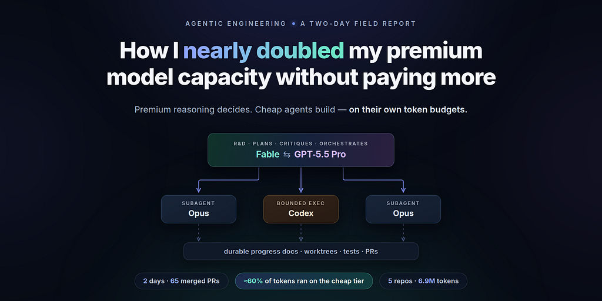
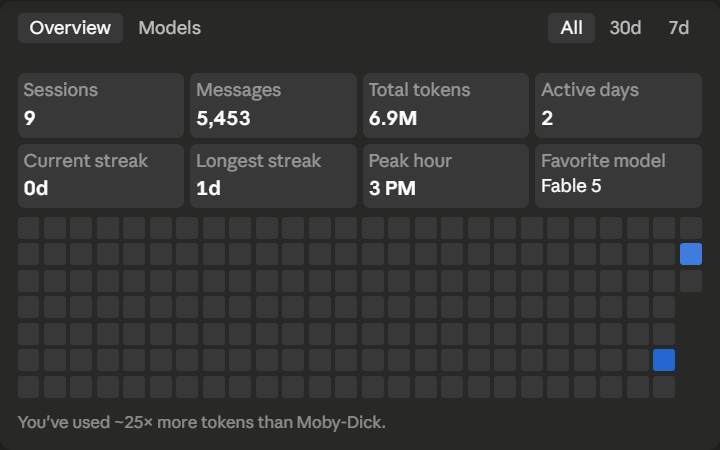
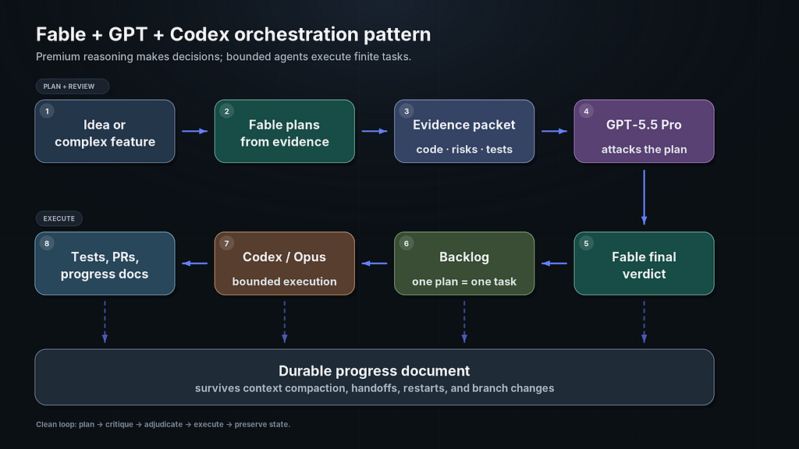
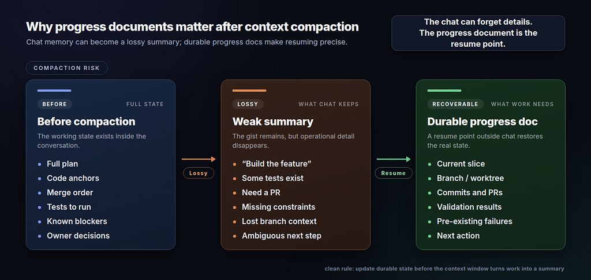
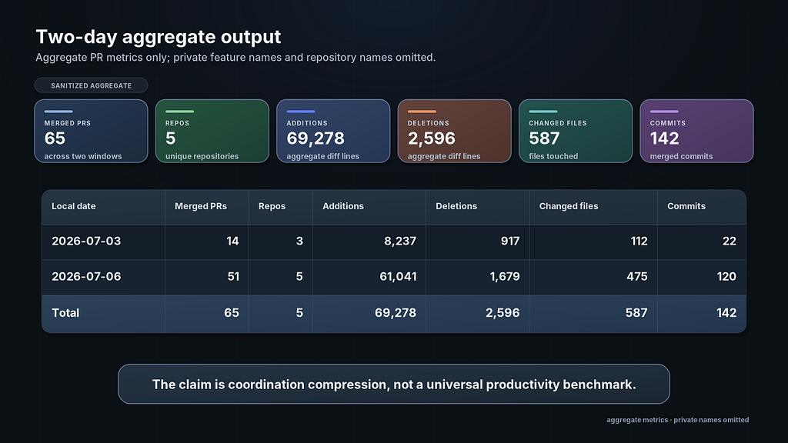
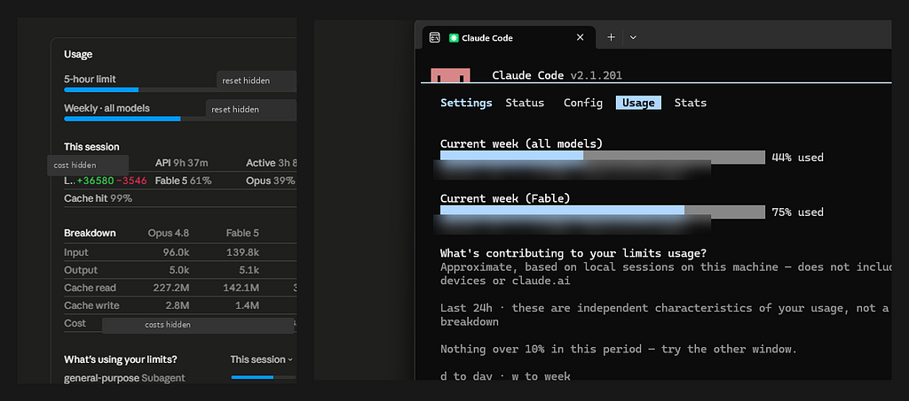

### Treat your most expensive model as an R&D department instead of trying to make it a coder: Fable plans and orchestrates, GPT-5.5 Pro attacks the plans, and Opus and Codex execute - on their own token budgets.



This workflow was born from scarcity.

I got access to Fable for a limited time - and I wanted to use it for the many major, complicated ideas I had lined up. The math was brutal: if I routed everything to the best model and let it handle the entire task - I would have burned through the usage allowance after completing perhaps a third of that list.

So I started running my models the way a company runs itself: an R&D department that is expensive, scarce, and reserved for decisions - and a production layer that is lower-cost, more abundant, and responsible for most of the implementation work. Fable made the plans, challenged assumptions, split the work into tasks, determined the sequencing, reviewed risky outputs, and coordinated the others. GPT-5.5 Pro played the independent critic: it reviewed each of Fable’s plans, surfaced real issues, suggested improvements, and sent the refined plan back to Fable for a final verdict before any code was written. Then, the lower-cost agents did the bounded implementation work - code changes, test runs, type checks, commits, pull requests, rebases, conflict resolution, and progress reporting.

Two intense working days later, the ideas I was ready to sacrifice were planned, reviewed, implemented, tested, and merged. And the part that makes this worth writing down is measurable: roughly three out of every five tokens in the measured Claude orchestration session were processed by the lower-cost execution tier, while the premium weekly budget remained at or below 75%. The full ledger is in the middle of this article - because it is the article.

> **Disclosure:**the real product behind these numbers is private. I am keeping the model and tool names where they matter, but the product, repository, prompts, diagrams, and feature descriptions are fictional or generalized analogues. I am publishing aggregate metrics and sanitized screenshots without any private code, private plans, raw repo names, customer data, or unreleased architecture.



**The Core Pattern**

My rule was simple:

> **_The premium model is R&D: it makes the expensive decisions. The lower-cost models are execution: they implement within the resulting constraints. Don’t spend premium reasoning on work that has already been made finite._**

In practice, that meant:

- **Claude Fable** handled planning, architecture judgment, orchestration, subagent task separation, and final verdicts.
- **Opus subagents** handled bounded implementation slices, read-only audits, test runs, code changes, and PR preparation.
- **GPT-5.5 Pro**acted as an independent critic of Fable’s plans.
- **Codex Desktop and Codex CLI** handled constrained coding tasks once the plan was already finite enough.

Fable was the lead engineer for this entire workflow.

And the subagents never got a vague “just implement it” prompt. Each one received a bounded task, relevant evidence, constraints, validation gates, and a required progress protocol. Looking back, that distinction mattered more than any of the model names.

**Why Planning Came First**

For critical features, I started with a planning packet. Models, like human engineers, perform better when the task has clear boundaries, relevant evidence, explicit constraints, and testable outcomes.

Fable scanned the actual codebase and wrote finite plans anchored in real code: current data flow, existing contracts, infrastructure constraints, plus vendor or internet research where needed. This was all done to prevent hallucinations, such as the model assuming imaginary APIs, and to ensure it reasoned strictly from evidence it could point to.

Each planning folder had roughly this structure: a problem statement, the product and engineering decisions, the final implementation plan, codebase evidence, a relationship map between important files and modules, research notes, a risk and gap analysis, a GPT-5.5 Pro review prompt, and a README summary for fast context loading.

Again, just like with real people, the README matters. GPT-5.5 Pro’s extended thinking can take a long time, and the last thing I wanted was to wait 15–20 minutes for a response that said, ‘I need more code evidence…duh.’ So I packaged the evidence carefully. Because the web app has practical file-count limits, I grouped related code excerpts into module-level evidence files. Each packet identified the source files, summarized their responsibilities, and explained how they affected the proposed plan.

The review prompt itself gave the critic a boundary and a job description. A sanitized version of the pattern:

```
> You are reviewing an implementation plan.
>
> Evaluate only the code evidence and facts provided. Do not invent APIs, tables, services, routes, or product behavior. If the evidence is insufficient, call that out as a gap.
>
> Review goals:
>
> 1. Identify missing acceptance tests.
> 2. Identify places where the plan overclaims.
> 3. Identify ambiguous rules or contracts.
> 4. Recommend changes that keep the first PR small.
>
> Return: a verdict (approve / approve with changes / reject), blocking issues, non-blocking improvements, and revised acceptance gates.
```

That one instruction - _do not invent, flag gaps instead_ - saved a lot of cleanup.

**The Review Loop**

1. Fable created a plan from codebase evidence.
2. I sent the plan and evidence packet to GPT-5.5 Pro extended thinking.
3. GPT-5.5 reviewed the plan for gaps, misalignments, missing tests, and risky assumptions.
4. I read the critique and refined the plan.
5. Fable reviewed the revised plan and gave a final verdict.

What surprised me was how often Fable agreed with the gaps GPT detected. That agreement was a useful signal, showing that GPT is still very much in play. Instead of just asking two models to generate different prose, I used one model to draft a plan, a second to attack it, and the first to adjudicate the critique.

A typical critique came back as something like: _approve with changes; no blocking issues; add a determinism test so future edits can’t introduce nondeterministic ordering; state explicitly that the scoring numbers are policy, not a ranking model._ Small, concrete, checkable. Exactly what you want before letting a cheaper agent loose on the code.

The result was a plan that an execution agent could follow without having to rediscover the architecture.



**The Backlog Made the Agents Legible**

Once the plans were ready, I turned them into a backlog. Each task had a status, an assigned AI lane, an evidence folder, an implementation progress document, a branch or worktree owner, and a clear next step. A sanitized slice of what that looked like:

```
| Task                  | Owner lane     | Status  | Evidence folder | Notes                              |
| --------------------- | -------------- | ------- | --------------- | ---------------------------------- |
| TRIAGE-S0-S3          | Codex          | Done    | `docs/`         | Pure implementation with tests     |
| TRIAGE-S4-UI          | Codex          | Pending | TBD             | Add UI only after logic stabilizes |
| TRIAGE-S5-PERSISTENCE | Human decision | Blocked | TBD             | Requires a real schema decision    |
```

This was necessary because multiple agents were working at once. Without a shared backlog, agentic work gets foggy very quickly - you lose track of what is done, what is blocked, what is stacked on what, what needs a human decision, and which worktree owns which branch.

With a backlog, the system becomes legible. One plan, one task, one owner lane.

**Context Compaction Is an Engineering Risk**

Most agentic coding tools eventually compact context: they summarize a long conversation into a smaller memory so the session can continue. Useful, and also dangerous.

In ordinary chat, losing a few details rarely matters. In a multi-repo implementation with migrations, contracts, CI gates, staged PRs, and cross-agent handoffs, losing one detail can break the run.

So I required an implementation progress document. After every completed slice, the agent updated it with what changed, which branch and worktree were used, which commits and PRs were created, which tests passed, which failures were pre-existing, which conflicts were resolved, what was still blocked, and what the next agent should do.

The document ended with explicit resume instructions, along the lines of:

> **_Resume notes_.** _If context is compacted, read these files in order: the problem statement, the plan, the final verdict, the task backlog, and this progress document._

> _The next reasonable slice is a small UI that renders the output of_createExecutionPlan_.\_

That acted like durable memory. If the model compacted context, crashed, or had to resume in a new session, the next model could reload the actual state instead of relying on a lossy summary.



**Fable as the Orchestrator**

For the most critical work, I started a fresh Fable instance and treated it as the main orchestrator. It would pull fresh `main` (the project was moving quickly), re-check the plan against current code, create or update the progress document, split the plan into slices, spawn cheaper subagents for bounded tasks, review their results, and ask me only when a real owner decision was needed.

The cheaper agents used separate git worktrees, and I’d call that mandatory rather than optional. Because when several agents work in the same repository, worktrees prevent a huge class of conflicts: each agent gets an isolated branch and filesystem view, can commit independently, run tests independently, and open PRs without stepping on anyone else.

The orchestrator still has to handle stacked branches, rebases, and merge order. But that is exactly the kind of coordination work where a high-reasoning model earns its cost.

**Codex for Constrained Execution**

Not every task deserves Fable.

Once the final plan was well-specified, Fable generated the execution packet, which I then handed off to Codex Desktop or Codex CLI. My Codex instruction pattern:

- read the task backlog first;
- read the relevant plan and code evidence;
- create a new worktree;
- keep the implementation progress document updated;
- commit after each major slice;
- run the relevant tests and type checks;
- update the branch against the latest main before opening the PR, using the repository’s expected merge or rebase strategy;
- resolve conflicts if any;
- open the PR and include validation evidence.

_I wrapped this routine into a reusable skill so I didn’t have to rewrite the protocol every time._

For me, Codex Desktop is excellent for letting the agent do background work without babysitting every command. Codex CLI is better when I want to stay close to the terminal and drive the flow directly.

**What the Run Produced**

```
### Planning and evidence

| Scope                                | Files | Characters |   Words |   Lines |
| ------------------------------------ | ----: | ---------: | ------: | ------: |
| Friday final execution packet        |    36 |    677,315 |  85,909 |   6,298 |
| Monday authored workflow docs        |    33 |    323,025 |  40,189 |   5,206 |
| Combined authored workflow docs      |    69 |  1,000,340 | 126,098 |  11,504 |
| Broader plan/evidence corpus scanned |   271 |  5,308,200 | 650,541 | 115,601 |
```

```
| Local date | Merged PRs | Repos | Additions | Deletions | Changed files | Commits |
|------------|-----------:|------:|----------:|----------:|--------------:|--------:|
| 2026-07-03 |         14 |     3 |     8,237 |       917 |           112 |      22 |
| 2026-07-06 |         51 |     5 |    61,041 |     1,679 |           475 |     120 |
| Total      |         65 |     5 |    69,278 |     2,596 |           587 |     142 |
```



These numbers should not be interpreted as 65 independent product features. The PRs ranged from focused contract and test changes to migrations, UI updates, deployment fixes, rebases, and integration work. Broadly speaking, the run included:

- AI gateway foundations, contracts, billing and usage invariants, and provider-call guards.
- Default agent provisioning, owner controls, settings surfaces, and staging deployment.
- Conversation-state correctness: pending, working, stopped, failed, source visibility, usage footers, and stuck-stream recovery.
- Explicit context selection and handoff from a planning surface into an agent thread.
- Local multi-round agent harness work with tool adapters, evidence gates, budgets, and cancellation.
- App/runtime infrastructure with install controls, grants, object-spine backfills, and retention tripwires.
- Production and staging hygiene: smoke testing, binding fixes, rebases, conflict resolution, CI, type checks, and test evidence.

> **Worth noting**: the line counts matter far less than the number of coordination surfaces involved: multiple repositories, stacked PRs, interface contracts, synchronized frontend and backend changes, migrations, runtime behavior, testing, and deployment order.

**What Would This Have Taken Manually?**

This comparison is necessarily subjective because the product and individual PRs are private.

Based on my experience with this codebase, completing the same planning, implementation, integration, testing, rebasing, deployment preparation, and progress documentation manually would have required several months of focused engineering work for one person. The exact duration would depend heavily on familiarity with the system and how much of the work could be parallelized.

Rather than merely compressing a specific number of engineering hours, AI collapsed a massive volume of planning, implementation, verification, and coordination into a dramatically shorter wall-clock window.

The models did not remove the need for architecture. They made architecture more important, because implementation could now move much faster than architectural ambiguity could safely tolerate.

**The Token Ledger: How Tiering Preserved the Premium Budget**

Everything above sounds like philosophy until you look at where the tokens actually went - because the real money we pay for them matters, doesn’t it? This section is the exact reason I wrote this article.

Here is a sanitized breakdown from one orchestration session on the Claude side - Fable as the lead, Opus subagents doing the bounded execution. (Codex ran in its own lane on a separate provider, so it can’t appear in this meter - its ledger comes right after.)

```
| One orchestration session    | Fable 5 (R&D lead) | Opus 4.8 (executors) |
| ---------------------------- | -----------------: | -------------------: |
| Input tokens                 |             139.8k |                96.0k |
| Output tokens                |               5.1k |                 5.0k |
| Cache read                   |             142.1M |               227.2M |
| Cache write                  |               1.4M |                 2.8M |
| Share of session limit usage |                61% |                  39% |
```

> Cache reads represent previously processed context that the model reused, not an equivalent amount of newly written output. That is why the cache figures are so much larger than the visible input and output totals. They still matter operationally because implementation agents repeatedly revisit code, plans, test output, and progress documents.

Two things in that table carry the whole argument.

**The executors moved most of the tokens.** As the numbers show, including cache traffic, the Opus subagents processed roughly 230 million token-equivalents of context, compared with roughly 144 million on the Fable side - about three-fifths of the measured context volume was handled by the lower-cost execution tier. Execution is token-hungry in a very specific way: an implementing agent constantly re-reads code, test output, plans, and progress documents, which is why cache reads dominate the table (the session’s cache hit rate was 99%). That is exactly the kind of bulk volume you never want landing on your premium budget. Here, it didn’t.

**The output columns are nearly identical - 5.1k vs 5.0k.** The cheap tier _wrote_ just as much as the lead. The difference is what the writing was: Fable’s output was plans, task briefs, and verdicts; Opus’s output was the actual diffs, commits, and PR descriptions. Nearly the same output volume, but a very different use of premium reasoning. If Fable had typed those diffs itself, I would have paid R&D rates for assembly-line work.

Now zoom out to the weekly budgets, which is where the savings become visible as a number:



After two days that produced 65 merged PRs, the **Fable weekly limit sat at 75%** while the **all-models weekly limit sat at 44%** (a shorter five-hour window was at 28%). Read those two numbers together: Fable was the binding constraint, the budget running hot. Every token of execution routed to Opus landed on the budget with headroom instead of the one nearing its ceiling.

The measured session alone shows how quickly implementation traffic could have consumed the remaining Fable allowance. Routing comparable execution work through Fable would likely have exhausted that remaining headroom before the run was complete.

And Codex is the extreme case: it runs on a separate provider’s budget entirely. Every slice routed to Codex Desktop or Codex CLI consumed **zero**Claude-side quota because it ran through a separate provider and subscription. From the Fable budget’s point of view, that work was free capacity.

I pulled the exact numbers from Codex’s local session logs for those two days (my GPT-5.5 Pro plan reviews ran through the same app, so they are included):

```
| Codex (OpenAI side) | Friday | Monday | Total |
| ------------------- | -----: | -----: | ----: |
| Input tokens        |  1.35M |  39.0M | 40.4M |
| - served from cache |  1.08M |  36.6M | 37.7M |
| Output tokens       |  15.6k |  20.1k | 35.6k |
| Total tokens        |  1.37M |  39.0M | 40.4M |
```

That is another 40 million tokens of execution that never touched the premium budget. Because roughly 93% of the recorded input was served from cache, even Monday’s large context volume consumed only a single-digit percentage of the separate Codex weekly allowance.

The output column tells a similar story. Across the two measured days, Codex produced roughly seven times as many output tokens as Fable produced in the referenced orchestration session - exactly the distribution I wanted between implementation and orchestration.

For scale, the account overview for the two active days showed **6.9M total tokens** and **5,453 messages**, with Fable as the favorite model.

I wouldn’t turn any of this into a universal pricing benchmark - these are usage-limit signals from one run. But the operational lesson generalizes: scarce premium reasoning should be budgeted like senior engineering attention, because that is what it is.

The spend pattern:

- spend Fable on planning and orchestration;
- spend GPT-5.5 Pro on independent plan criticism;
- spend Opus or Codex on scoped execution so that most implementation traffic lands on allowances with more headroom or on a separate provider budget
- spend human attention on owner decisions, risky judgment calls, and final taste.

Same throughput, roughly double the effective premium capacity. That’s the saved-money value, and it required no discount, no negotiation, and no new tooling - just routing.

**What I Would Improve Next Time**

The workflow succeeded, but several parts were still too manual.

Next time, I would create the dashboard and backlog much earlier; once multiple agents are moving, even a small ambiguity becomes expensive. I would also make branch dependencies and merge order explicit before implementation starts, rather than after the first stack of PRs appears.

I would separate architecture packets from execution packets more aggressively. A reviewer needs evidence and risk analysis; an implementer needs bounded steps, branch instructions, validation gates, and progress-document rules. Related artifacts, but not the same artifact.

Additionally, I would prepare the publishing assets earlier. Screenshots, metrics tables, and diagrams need their own privacy review, and it is far easier to design for privacy up front than to crop and redact a messy screenshot later.

Finally, I would definitely automate that back-and-forth plan juggling.

**The Copyable Version**

Here is the protocol I would hand to another engineer:

1. Do not start by asking an AI to implement a complex feature.
2. Send that plan to a different strong model and ask it to review the plan adversarially for unsupported assumptions, missing tests, ambiguous contracts, and unsafe sequencing.
3. Send that plan to a different strong model and ask it to attack the plan.
4. Return the critique to the planning model and require it to accept, reject, or revise each material point.
5. Convert the final plan into a backlog of bounded tasks.
6. Give each task an evidence folder, owner lane, worktree, validation gates, and progress document.
7. Use premium reasoning for architecture, sequencing, risk, and orchestration.
8. Use lower-cost agents for scoped implementation work whose dependencies and validation criteria are already clear.
9. Keep durable progress outside the chat context.
10. Require validation evidence before merging.

The stronger the model, the more tempting it is to use it for everything. I now think that instinct is backwards. Premium reasoning is most valuable where mistakes are expensive: architecture, context selection, contract design, sequencing, risk detection, and orchestration.

Once those decisions have converted an ambiguous problem into finite work, lower-cost models can carry much of the implementation volume. Human attention remains essential for product ownership, high-risk judgment calls, validation, and final taste.

The future of agentic engineering isn’t one giant prompt. It is a small operating system for thought, evidence, execution, and review.
