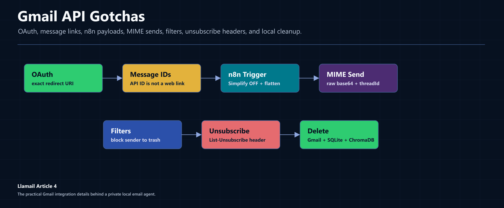
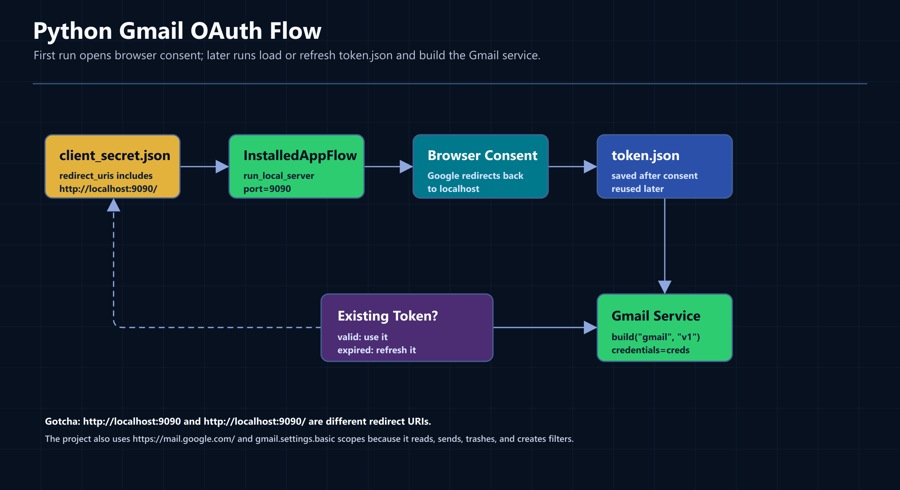
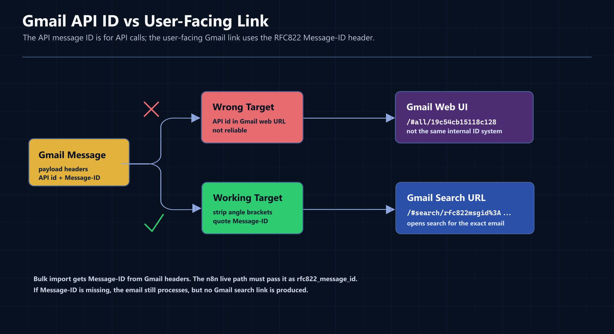
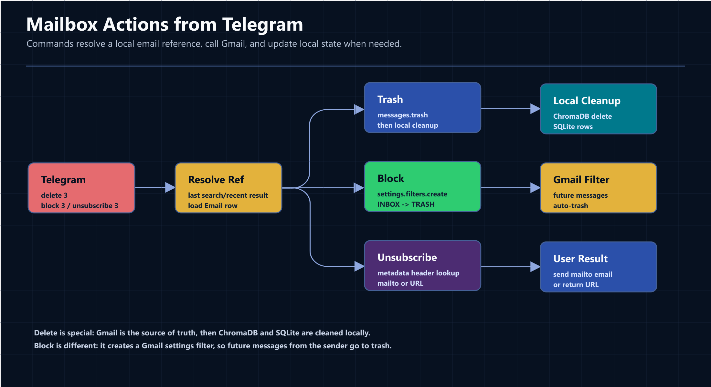

In the first article, I showed the whole Llamail system: Gmail, Telegram, n8n, FastAPI, llama.cpp, SQLite, ChromaDB, and a local synthetic assistant named Sable.

In the second article, I covered the local hybrid RAG layer behind `/search` and `/ask`.

In the third article, I covered the Telegram command router: slash commands, safe compound commands, and LLM intent classification.

This article is about the Gmail API details that quietly shaped the whole project because it's the core as for my personal case everything is bound around gmail.

If you missed the previous articles:

[Part 1: From Inbox to Character: Creating a Private, Local AI Email Agent](/articles/private-local-ai-email-agent)

[Part 2: How `/search` and `/ask` Work: Local Hybrid RAG with ChromaDB + SQLite FTS5](/articles/local-hybrid-rag-chromadb-sqlite-fts5)

[Part 3: LLM as Router: Intent Classification for a Local Telegram Email Agent](/articles/llm-as-router-intent-classification)

The AI parts of this project are fun to talk about, but a lot of the real implementation pain came from boring integration details:

- OAuth redirect URIs have to match exactly.
- Gmail API message IDs are not useful as Gmail web links.
- n8n's simplified Gmail payload is too small for a serious processing pipeline.
- Sending replies needs the Gmail `threadId`.
- Blocking senders is not a message operation; it is a Gmail filter.
- Unsubscribe is hidden in headers and can be either `mailto:` or an HTTP(S) URL.
- Deleting an email has to update Gmail, SQLite, and ChromaDB.

Here is what actually worked in the code.

---

## The Gmail Layer in This Project


_The Gmail layer includes uthentication, import, live ingestion, sending, blocking, unsubscribing, and local cleanup._

The Gmail integration lives mostly in:

```text
webservice/src/email_service/services/gmail_client.py
```

That file handles:

- OAuth and token refresh
- listing Gmail message IDs for bulk import
- fetching full Gmail messages
- extracting headers, body text, and attachment metadata
- sending MIME messages
- trashing emails
- creating Gmail filters for blocked senders
- reading `List-Unsubscribe`

The Telegram command handlers live in:

```text
webservice/src/email_service/services/cmd_email.py
webservice/src/email_service/services/cmd_draft.py
```

The email processing pipeline lives in:

```text
webservice/src/email_service/services/email_processor.py
```

That split matters because the Gmail client does Gmail API operations and the command handlers decide what the user asked for. The processor turns an incoming or imported email into local searchable data.

---

## OAuth: The Redirect URI Has to Match Exactly


_The Python Gmail client uses a local browser OAuth flow once, saves `token.json`, then refreshes and reuses that token silently._

The Python service uses Google's installed-app flow:

```python
def get_gmail_service():
    creds = None

    if settings.gmail_token_path.exists():
        creds = Credentials.from_authorized_user_file(
            str(settings.gmail_token_path), settings.gmail_scopes
        )

    if not creds or not creds.valid:
        if creds and creds.expired and creds.refresh_token:
            creds.refresh(Request())
        else:
            flow = InstalledAppFlow.from_client_secrets_file(
                str(settings.gmail_credentials_path), settings.gmail_scopes
            )
            creds = flow.run_local_server(port=9090, prompt="consent")

        settings.gmail_token_path.parent.mkdir(parents=True, exist_ok=True)
        with open(settings.gmail_token_path, "w") as f:
            f.write(creds.to_json())

    return build("gmail", "v1", credentials=creds)
```

The important part is this line:

```python
creds = flow.run_local_server(port=9090, prompt="consent")
```

That means the Python app expects this redirect URI:

```text
http://localhost:9090/
```

The trailing slash is really important because Google does exact string matching for redirect URIs. In the Google Cloud Console, this:

```text
http://localhost:9090
```

is not the same as this:

```text
http://localhost:9090/
```

If they do not match, the error is usually:

```text
redirect_uri_mismatch
```

For this project, the OAuth settings are in:

```python
gmail_credentials_path: Path = Path("credentials/client_secret.json")
gmail_token_path: Path = Path("credentials/token.json")
gmail_scopes: list[str] = [
    "https://mail.google.com/",
    "https://www.googleapis.com/auth/gmail.settings.basic",
]
```

The first scope gives the project broad Gmail access: read, send, trash, and mailbox operations. The second scope is needed because blocking senders creates Gmail settings filters.

n8n uses a different redirect URI for its own Gmail credential:

```text
http://localhost:5678/rest/oauth2-credential/callback
```

The practical setup is: one Google Cloud OAuth client can include both redirect URIs if you use both Python and n8n. The Python code uses `9090`; n8n uses `5678`.

One more Windows-specific annoyance: common local ports are often already occupied. The project uses `8000` for the FastAPI webservice, `5678` for n8n, and `9090` for the one-time Python OAuth callback. If `9090` is occupied, change the port in `run_local_server(...)` and update the redirect URI in both `client_secret.json` and Google Cloud Console.

---

## Gmail API IDs Are Not Gmail Web Links


_The Gmail API ID is good for API calls. For a user-facing Gmail link, the project generates a search URL from the RFC822 `Message-ID` header._

The Gmail API returns message IDs like this:

```text
19c54cb15118c128
```

That ID is useful for API calls:

```python
service.users().messages().get(userId="me", id=gmail_id, format="full").execute()
```

URL like this might be tempting, but it isn't a reliable deep link for the Gmail web UI.

```text
https://mail.google.com/mail/u/0/#all/19c54cb15118c128
```

In practice, that does not reliably open the message. The nuance is that Gmail's browser UI uses its own internal identifiers.

The workaround is the RFC822 `Message-ID` header.

When the project fetches a Gmail message, it stores this value:

```python
headers = {h["name"].lower(): h["value"] for h in msg["payload"]["headers"]}

return {
    "gmail_id": gmail_id,
    "thread_id": msg.get("threadId"),
    ...
    "rfc822_message_id": headers.get("message-id"),
}
```

Then the email processor generates a Gmail search link:

```python
def _build_gmail_link(rfc822_message_id: str | None) -> str | None:
    if not rfc822_message_id:
        return None
    clean_id = rfc822_message_id.strip("<>")
    return f"https://mail.google.com/mail/u/0/#search/rfc822msgid%3A{quote(clean_id)}"
```

That produces a URL shaped like this:

```text
https://mail.google.com/mail/u/0/#search/rfc822msgid%3Aabc123%40mail.example
```

It opens Gmail search for that exact message ID. It is one extra conceptual step compared with a perfect deep link, but it is dependable.

The implementation depends on the incoming pipeline preserving `Message-ID`. Bulk import gets it from the Gmail API `headers` array. The live n8n path must also send it into the webservice as `rfc822_message_id`.

---

## The n8n "Simplify" Trap

The live email path uses n8n as the bridge:

```text
Gmail Trigger
    -> Code node
    -> POST /process-email
    -> FastAPI webservice
```

The FastAPI route expects this Pydantic request:

```python
class ProcessEmailRequest(BaseModel):
    account_id: str
    gmail_id: str
    thread_id: str | None = None
    rfc822_message_id: str | None = None

    from_address: str
    from_name: str | None = None
    to_addresses: list[str] = []
    cc_addresses: list[str] = []

    subject: str | None = None
    body_text: str
    snippet: str | None = None
    received_at: datetime

    gmail_labels: list[str] = []
    attachments: list[dict] = []
```

That means the webservice wants the real body text, Gmail ID, thread ID, RFC822 message ID, labels, and attachment metadata.

n8n's Gmail Trigger has a "Simplify" option. The simplified output is convenient, but it is too small for this project. It tends to give you easy fields like sender, subject, and snippet, while dropping the details that matter later: the RFC822 `Message-ID`, the full body text, and attachment info.

The fix is to turn Simplify off and add a Code node that flattens the trigger output into the shape the webservice expects.

One detail that surprised me: with Simplify off, n8n does not hand you the raw Gmail API payload with a `payload.headers` array. The trigger runs the message through a mail parser first, so the output already has structured fields: `from.value`, `subject`, `text`, `date`, and `messageId` (which is the RFC822 `Message-ID`).

A simplified version of this project's Code node looks like this:

```javascript
const msg = $input.first().json;

return [
  {
    json: {
      account_id: msg.to?.value?.[0]?.address || "",
      gmail_id: msg.id,
      thread_id: msg.threadId,
      rfc822_message_id: msg.messageId || "",
      from_address: msg.from?.value?.[0]?.address || "",
      from_name: msg.from?.value?.[0]?.name || "",
      subject: msg.subject || "",
      body_text: msg.text || "",
      received_at: msg.date || "",
      gmail_labels: msg.labelIds || [],
      attachments: [],
    },
  },
];
```

The full version also assembles attachment metadata (filename, MIME type, size) from the trigger's binary data, because the trigger runs with "Download Attachments" enabled.

The exact field names can shift between n8n versions, but the important point is the contract: send the fields the Python model expects. If `rfc822_message_id` is missing, the email can still be processed, but the Gmail search link will be `None`. If `thread_id` is missing, campaign reply tracking and reply threading become weaker.

---

## Fetching Email: Full Format, Lowercase Headers, Recursive Body Parsing

Bulk import uses the Gmail API directly. First it lists message IDs:

```python
result = (
    service.users()
    .messages()
    .list(userId="me", maxResults=batch_size, pageToken=page_token)
    .execute()
)

messages = result.get("messages", [])
ids.extend(msg["id"] for msg in messages)
```

Then each message is fetched with `format="full"`:

```python
msg = (
    service.users()
    .messages()
    .get(userId="me", id=gmail_id, format="full")
    .execute()
)
```

The code normalizes headers into a lowercase dictionary:

```python
headers = {h["name"].lower(): h["value"] for h in msg["payload"]["headers"]}
```

That avoids a whole class of annoying header-case bugs. `Message-ID`, `message-id`, and `MESSAGE-ID` all become:

```python
headers.get("message-id")
```

The body extractor is recursive:

```python
def _extract_body(payload: dict) -> str:
    if payload.get("mimeType") == "text/plain" and payload.get("body", {}).get("data"):
        return base64.urlsafe_b64decode(payload["body"]["data"]).decode("utf-8")

    for part in payload.get("parts", []):
        result = _extract_body(part)
        if result:
            return result
    return ""
```

This is intentionally simple. It looks for `text/plain` and returns the first matching body it finds. That is enough for the current local assistant. A production mail client would need more MIME handling: HTML fallback, charsets, inline images, nested alternatives, and probably attachment body download. For this project, I only need enough clean text to summarize and search the email.

Attachment handling is also metadata-only for incoming messages:

```python
def _extract_attachments(payload: dict) -> list[dict]:
    attachments = []
    for part in payload.get("parts", []):
        filename = part.get("filename")
        if filename:
            attachments.append(
                {
                    "filename": filename,
                    "mime_type": part.get("mimeType", "application/octet-stream"),
                    "size_bytes": part.get("body", {}).get("size", 0),
                }
            )
        attachments.extend(_extract_attachments(part))
    return attachments
```

The system stores attachment names because they are useful for search and summarization and it does not download incoming attachment bytes yet.

---

## Sending: MIME, Base64, Threads, and Attachments

Sending is another place where Gmail's API is simple but strict.

The project constructs a MIME message, URL-safe-base64 encodes the bytes, and sends that as the `raw` field:

```python
message = MIMEText(body)
message["to"] = to
message["subject"] = subject

raw = base64.urlsafe_b64encode(message.as_bytes()).decode("utf-8")
send_body: dict = {"raw": raw}

sent = service.users().messages().send(userId="me", body=send_body).execute()
```

For replies, the important field is `threadId`:

```python
if thread_id:
    send_body["threadId"] = thread_id
```

The draft command preserves the original email's thread:

```python
draft = Draft(
    draft_type="reply",
    to_address=from_address,
    subject=suggested_subject,
    body=reply_body,
    original_email_id=email_id,
    thread_id=thread_id,
)
```

Then `send` passes that thread ID back into `gmail_client.send_email(...)`:

```python
gmail_client.send_email(
    service,
    to=draft.to_address,
    subject=draft.subject or "",
    body=draft.body,
    thread_id=draft.thread_id,
)
```

Without that, a reply could become a fresh email instead of staying in the original Gmail conversation.

The same send function also supports attachments. If `attachment_path` is present, it constructs a `MIMEMultipart` message:

```python
message = MIMEMultipart()
message["to"] = to
message["subject"] = subject
message.attach(MIMEText(body))

path = Path(attachment_path)
with open(path, "rb") as f:
    part = MIMEBase("application", "octet-stream")
    part.set_payload(f.read())
encoders.encode_base64(part)
part.add_header("Content-Disposition", f'attachment; filename="{path.name}"')
message.attach(part)
```

That path is used by the campaign sender. Campaigns can attach a file from the configured campaigns directory and then send personalized messages at a controlled rate.

---

## Blocking Senders Is a Gmail Filter


_User commands resolve a local email reference, then call Gmail for mailbox-side effects and update local state when needed._

The `block` command starts as a Telegram command:

```text
block 3
```

The command handler resolves `3` against the last search or recent results, loads the local email row, and extracts `from_address`.

Then the Gmail client creates a settings filter:

```python
def block_sender(service, from_address: str) -> None:
    filter_body = {
        "criteria": {"from": from_address},
        "action": {"removeLabelIds": ["INBOX"], "addLabelIds": ["TRASH"]},
    }
    service.users().settings().filters().create(userId="me", body=filter_body).execute()
```

That is the key detail: blocking future messages is not a Gmail message operation. It is a Gmail settings operation. That is why the project includes:

```python
"https://www.googleapis.com/auth/gmail.settings.basic"
```

in addition to the broader Gmail scope.

Instead of just deleting this single email, create a Gmail rule to automatically route all future messages from this sender straight to the trash.

---

## Unsubscribe Is just a Header, Not a Button

The `unsubscribe` command also starts from a local email reference:

```text
unsubscribe 3
```

The handler resolves the local email, gets its Gmail API ID, and asks Gmail for only one header:

```python
msg = (
    service.users()
    .messages()
    .get(
        userId="me",
        id=gmail_id,
        format="metadata",
        metadataHeaders=["List-Unsubscribe"],
    )
    .execute()
)
```

Using `format="metadata"` keeps this lookup small. The full email body is not needed just to check unsubscribe information.

The parser currently handles two common forms:

```python
mailto_match = re.search(r"<mailto:([^>]+)>", raw)
url_match = re.search(r"<(https?://[^>]+)>", raw)
```

If a `mailto:` unsubscribe is present, the Telegram command automatically sends a short unsubscribe email:

```python
gmail_client.send_email(
    service,
    to=unsub_address,
    subject=subject,
    body="Unsubscribe",
)
```

If an HTTP(S) URL is present, the bot returns the URL and lets the user click it.

If neither is present, the bot suggests blocking the sender instead:

```text
No unsubscribe header found.
You can block this sender instead: block 3
```

There is one intentionally boring limitation here: the current code parses the mailto subject with simple string splitting. It works for basic newsletter headers, but it does not URL-decode every possible mailto parameter. That is fine for my current mailbox, but it is a clear place to harden the parser later.

---

## Deleting Has to Clean Up Three Places

The `delete` command is easy to underestimate.

The local assistant stores each email in:

- Gmail, as the real source of truth
- SQLite, as structured local metadata and FTS5 search data
- ChromaDB, as the semantic search record

so deleting an email isn't as simple as:

```python
session.delete(email)
```

The command first trashes the Gmail message:

```python
service = gmail_client.get_gmail_service()
gmail_client.trash_email(service, gmail_id)
```

The Gmail client does this:

```python
service.users().messages().trash(userId="me", id=gmail_id).execute()
```

Only after Gmail succeeds does the command try to remove the local vector record:

```python
try:
    embeddings.delete(email_id)
except Exception as e:
    logger.warning(f"ChromaDB delete failed: {e}")
```

Then it deletes chunks and the parent email row from SQLite:

```python
session.query(EmailChunk).filter(EmailChunk.email_id == email_id).delete()
session.query(Email).filter(Email.id == email_id).delete()
```

This sequence is intentional. If Gmail trashing fails, execution halts to protect local data. Conversely, if ChromaDB cleanup fails, a warning is logged while SQLite deletion proceeds. For a personal assistant, this is a pragmatic trade-off: Gmail represents the source of truth, whereas local vector indexes can always be regenerated or retried.

---

## The Pattern Behind All of This

The Gmail API layer works best when each operation has a clear boundary:

```text
OAuth:
    initialize Gmail service

Import:
    list IDs -> fetch full messages -> normalize into ProcessEmailRequest

Live n8n pipeline:
    flatten raw Gmail trigger payload -> POST the same ProcessEmailRequest shape

Open in Gmail:
    use RFC822 Message-ID search link instead a Gmail API ID

Send:
    MIME -> urlsafe base64 -> messages.send

Reply:
    preserve threadId

Block:
    create settings filter

Unsubscribe:
    read List-Unsubscribe metadata header

Delete:
    trash in Gmail -> clean ChromaDB -> clean SQLite
```

The Gmail API is tricky primarily because its features are scattered across entirely different parts of the system:

- messages
- threads
- headers
- MIME
- OAuth
- filters
- labels
- local state

Once those boundaries are explicit, the code becomes much easier to reason about.

For Llamail, the final result is a Telegram assistant that can import emails, summarize them, search them, draft replies, send messages, block senders, unsubscribe from newsletters, and keep everything searchable locally.

The code is here:
[github.com/sviat-barbutsa/llamail](https://github.com/sviat-barbutsa/llamail)

In the next article, I will cover the campaign system: CSV loading, LLM personalization, throttled sending, reply tracking, and how Sable classifies campaign replies.
