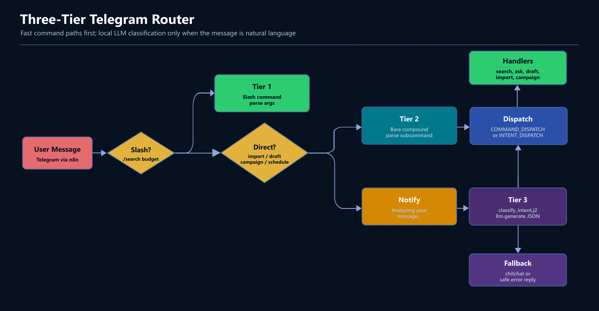
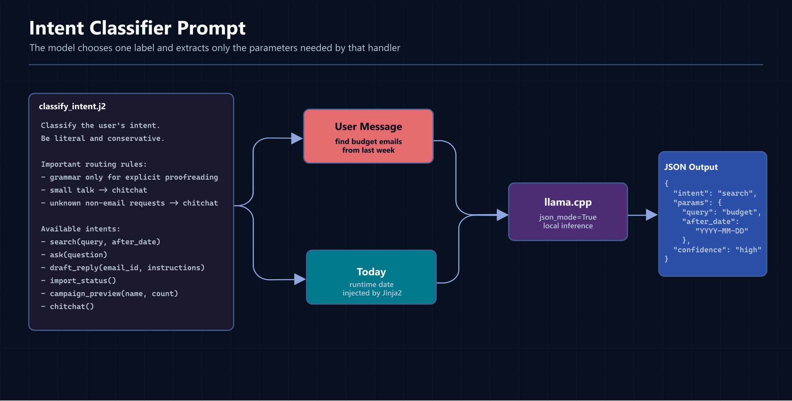
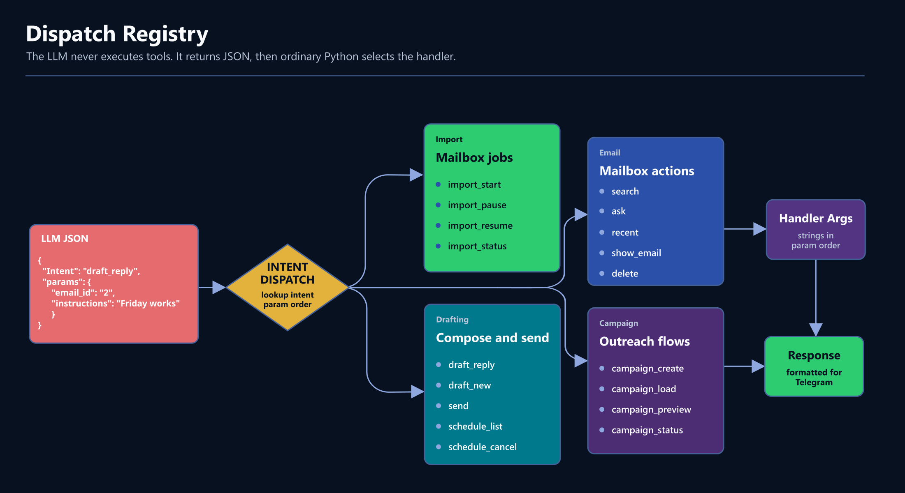

In the first article, I showed the whole Llamail system: Gmail, Telegram, n8n, FastAPI, llama.cpp, SQLite, ChromaDB, and a local synthetic assistant named Sable.

In the second article, I went under the hood of `/search` and `/ask`: hybrid retrieval with ChromaDB semantic search plus SQLite FTS5 keyword search.

This article is about the command layer in front of that.

If you missed part 1, start there first:
[From Inbox to Character: Creating a Private, Local AI Email Agent](/articles/private-local-ai-email-agent)

Part 2 covers the retrieval layer this router sits in front of:
[How `/search` and `/ask` Work: Local Hybrid RAG with ChromaDB + SQLite FTS5](/articles/local-hybrid-rag-chromadb-sqlite-fts5)

Alright, the intro is over, so let's dive into the interesting part.
At first, my Telegram agent only understood direct commands:

```text
/search budget Q2
/recent 5
/draft reply 3 agree and ask for Friday
/import status
```

That worked, but it is not how people naturally talk to an assistant, so I wanted to just type:

```text
how is my import going?
find emails from last week about the budget
write a reply to the second email saying Friday works
```

The wrong way to solve that is to handle it the old-fashioned way: with a pile of regexes. The more commands you add, the more fragile the parser becomes. That is not how an assistant should work in the LLM era.

The useful pattern is: keep exact commands for a precise and quick result, but use the local LLM as a router when the message is natural language. The router does not answer the user directly; it returns structured JSON like this:

```json
{
  "intent": "import_status",
  "params": {},
  "confidence": "high"
}
```

Then normal Python code dispatches that intent to the real handler.

---

## The Router Has Three Tiers

_Three-tier routing: slash commands and safe compound commands stay deterministic, while natural language goes through the classifier._

The main idea is that the router doesn't just "send everything to the LLM". That would be slow, less predictable and, if it were cloud-hosted instead of local, more expensive. Instead, it uses three tiers:

```text
User message
    |
    |-- Tier 1: /slash command
    |       /import status -> handle_import()
    |
    |-- Tier 2: direct compound command
    |       import status -> handle_import()
    |
    |-- Tier 3: natural language
            how is my import going?
            -> classify_intent.j2
            -> {"intent": "import_status", "params": {}}
            -> import_status()
```

**Tier 1** is for explicit slash commands. These are the fastest and most predictable. If I type `/import status`, the agent shouldn't spend several seconds asking a model what I probably meant.

**Tier 2** is for a small set of direct compound commands. In the current code, that set is quite narrow:

```python
_DIRECT_COMMANDS = {"import", "draft", "campaign", "schedule"}
```

Those commands normally have subcommands: `import status`, `draft reply`, `campaign preview`, `schedule list`. They are safe to recognize without a slash because the first word is acting like a command namespace.

**Tier 3** is the natural language fallback. If the message is not a slash command and not one of those direct compound command families, the router asks the LLM to classify it.

This matters because a naive bare-command parser can hijack ordinary language. If every first word were treated as a command, a message like this could break:

```text
show me the latest emails from John
```

The first word is `show`, but the user is not giving the low-level `/show` command with an email number. They are asking naturally. In this design, bare `show` does not bypass the LLM. Natural language goes to the classifier, and `/show 3` remains the exact command.

---

## The Entry Point

The Telegram router lives in:

```text
webservice/src/email_service/services/telegram_handler.py
```

The entry point is `handle_command()`. This is the simplified shape of it:
(There are quite a few conditional branches, but the goal is simplicity and efficiency)

```python
def handle_command(text: str, chat_id: str | int = "") -> str:
    text = text.strip()
    if not text:
        return "Empty message. Type '/help' for commands."

    chat_id_str = str(chat_id)
    chat_memory.save_message(chat_id_str, "user", text)

    command = None
    other_args = []
    if text.startswith("/"):
        parts = text[1:].split()
        command = parts[0].lower()
        other_args = parts[1:]
    else:
        parts = text.split()
        first_word = parts[0].lower()
        if first_word in _DIRECT_COMMANDS:
            command = first_word
            other_args = parts[1:]

    if command:
        handler_info = COMMAND_DISPATCH.get(command)
        if handler_info:
            handler, needs_chat_id = handler_info
            if needs_chat_id:
                reply = handler(other_args, chat_id_str)
            else:
                reply = handler(other_args)
        else:
            reply = f"Unknown command: /{command}\nType /help for available commands."
    else:
        reply = _llm_route(text, chat_id_str)

    chat_memory.save_message(chat_id_str, "assistant", reply)
    return reply
```

There are two details here that are easy to miss.

**First**, the router saves both the user message and the assistant reply. That gives the conversational parts of the system a short memory without making the command handlers themselves responsible for chat history.

**Second**, the exact command path and the natural language path end in the same handler functions. Natural language classification does not create a second implementation of search, drafting, import status, or campaign actions. It only decides which existing function should run.

---

## Slash Commands Still Matter

I still keep a normal command dispatch table:

```python
COMMAND_DISPATCH = {
    "help": (lambda *_: HELP_TEXT, False),
    "accounts": (lambda *_: account_info(), False),
    "search": (search, False),
    "recent": (recent, False),
    "import": (handle_import, False),
    "show": (show_email, False),
    "delete": (delete_email, False),
    "block": (block_sender, False),
    "unsubscribe": (unsubscribe, False),
    "grammar": (grammar, False),
    "ask": (ask, True),
    "draft": (handle_draft, False),
    "send": (send_email, False),
    "schedule": (handle_schedule, False),
    "campaign": (handle_campaign, False),
}
```

That is the practical part of the design. The LLM router makes the agent feel conversational, but command dispatch keeps it usable when I know exactly what I want.

For example:

```text
/recent 10
/search invoice 4521
/show 2
/delete 4
```

Those should be boring and deterministic because a good assistant shouldn't turn every button press into a reasoning problem or waste computation on simple cases.

---

## The Classifier Prompt

The natural language path uses one Jinja2 template:

```text
webservice/src/email_service/templates/classify_intent.j2
```

_The classifier prompt is a small contract: valid intents, expected params, conservative routing rules, and JSON-only output._

The current prompt is intentionally conservative:

```jinja2
Classify the user's intent from their message.
You are Sable's intent router for a private local email system.
Be literal, precise, and conservative. If a real command can reasonably be inferred, select it.
If the message is a greeting, thanks, or small talk, classify it as `chitchat`.

Important routing rules:
- Choose `grammar` ONLY when the user explicitly asks to fix, correct, proofread, rewrite, or improve grammar/spelling/style.
- Requests for recipes, explanations, opinions, brainstorming, recommendations, or general conversation are `chitchat`, not `grammar`.
- If the message is not clearly an email command and not explicitly a proofreading request, prefer `chitchat`.
- If unsure between `grammar` and `chitchat`, choose `chitchat`.

Examples:
- "fix grammar: I wants to meeting on tuesday" -> {"intent":"grammar","params":{"text":"I wants to meeting on tuesday"},"confidence":"high"}
- "recommend a movie for tonight" -> {"intent":"chitchat","params":{},"confidence":"high"}
- "what did John say about the budget?" -> {"intent":"ask","params":{"question":"what did John say about the budget?"},"confidence":"high"}

Available intents:
- import_start: User wants to start importing emails. Params: account, count
- import_status: User wants to check import progress. Params: none
- search: User wants to find emails by keyword or topic. Params: query, after_date
- ask: User wants to ask a question about their emails. Params: question
- draft_reply: User wants to draft a reply to an existing email. Params: email_id, instructions
- recent: User wants to see latest processed emails. Params: count
- chitchat: Greetings, thanks, small talk, or anything that is NOT a real command. Params: none

User message: {{ message }}

Return ONLY valid JSON:
{
    "intent": "one of the intent names above",
    "params": {},
    "confidence": "high | medium | low"
}
```

That is not the full template because it is too long for an already long article, but it shows the shape. The real version lists the classifier-visible intents for import controls, search, ask, email actions, drafting, grammar correction, campaign management, account info, help, and chitchat. The dispatch table below contains `29` callable destinations, including scheduled-send helpers.

The prompt does a few important things:

- It defines the router just as a classifier.
- It lists every classifier-visible destination.
- It names the required parameters for each intent.
- It includes `today`, so phrases like "last week" or "past 3 days" can become an ISO date.
- It treats `chitchat` as a real intent instead of forcing every message into an email action.

The `grammar` intent is a small writing utility integrated into the same Telegram agent. It's just a useful helper I use every day as a non-native English speaker. If I type something like `fix grammar: I wants to meeting on tuesday`, the router sends only that text to a dedicated proofreading prompt and returns the corrected version. It is useful when I want to clean up a sentence before pasting it into a reply, without asking the model to search my mailbox or compose a full email.

The `grammar` rules are there because a small model can over-eagerly interpret general writing requests as proofreading. Without those guardrails, a message like "recommend a movie for tonight" can accidentally become a grammar task. The prompt tells the model that recipes, recommendations, explanations, opinions, and ordinary small talk belong in `chitchat`.

---

## The LLM Route

The fallback route is small:

```python
def _llm_route(text: str, chat_id: str) -> str:
    try:
        telegram_notifier.notify("Analyzing your message...")

        prompt = _classify_template.render(
            message=text, today=datetime.now().strftime("%Y-%m-%d")
        )
        raw = llm.generate(prompt)
        parsed = parse_json(raw)

        intent = parsed.get("intent", "chitchat")
        params = parsed.get("params", {})

        if intent == "chitchat":
            return chitchat(text, chat_id)

        if intent not in INTENT_DISPATCH:
            return chitchat(text, chat_id)

        handler, param_keys = INTENT_DISPATCH[intent]

        args = []
        for key in param_keys:
            if key in params and params[key] is not None:
                args.append(str(params[key]))

        if intent == "ask":
            return handler(args, chat_id)
        if param_keys:
            return handler(args)
        return handler()

    except Exception as e:
        logger.error(f"LLM routing failed: {e}")
        return "Sorry, I couldn't understand that. Type 'help' for available commands."
```

The first line inside the `try` block is a UX trick (a simple loader analogue from the UI world):

```python
telegram_notifier.notify("Analyzing your message...")
```

Local inference can take a few seconds. If the user sends a natural language message through n8n and hears nothing until the model finishes, the agent feels frozen. The notifier sends a direct Telegram push immediately, then the normal n8n response arrives after classification and handler execution.

This is not required for correctness, but it is a good UX pattern because it makes the agent feel more responsive and robust.

---

## Dispatch Is Just a Registry



The classifier returns an intent name and some params. Python does the rest:

```python
INTENT_DISPATCH = {
    "import_start": (import_start, ["account", "count"]),
    "import_pause": (import_pause, ["account"]),
    "import_resume": (import_resume, ["account"]),
    "import_status": (import_status, []),
    "import_history": (import_history, ["account"]),
    "draft_reply": (draft_reply, ["email_id", "instructions"]),
    "draft_new": (draft_new, ["recipient", "instructions"]),
    "send": (send_email, ["draft_id"]),
    "schedule_list": (schedule_list, []),
    "schedule_cancel": (schedule_cancel, ["draft_id"]),
    "accounts": (account_info, []),
    "search": (search, ["query", "after_date"]),
    "show_email": (show_email, ["number"]),
    "delete": (delete_email, ["number"]),
    "block": (block_sender, ["number"]),
    "unsubscribe": (unsubscribe, ["number"]),
    "grammar": (grammar, ["text"]),
    "ask": (ask, ["question"]),
    "recent": (recent, ["count"]),
    "help": (lambda: HELP_TEXT, []),
    "campaign_create": (campaign_create, ["name", "template_file", "subject_template"]),
    "campaign_load": (campaign_load, ["name", "csv_file"]),
    "campaign_personalize": (campaign_personalize, ["name"]),
    "campaign_preview": (campaign_preview, ["name", "count"]),
    "campaign_status": (campaign_engine.get_all_campaigns_status, []),
    "campaign_results": (campaign_results, ["name"]),
    "campaign_start": (campaign_start, ["name"]),
    "campaign_pause": (campaign_pause, ["name"]),
    "campaign_resume": (campaign_resume, ["name"]),
}
```

This is the main reason the pattern stays understandable. The LLM never receives database sessions, Gmail clients, draft IDs, OAuth objects, or tool objects. It only chooses a label and extracts strings.

The system boundary is clean:

```text
LLM responsibility:
    "What does the user want?"

Python responsibility:
    "Is that a valid action, and how do we execute it safely?"
```

That separation also makes smaller local models more useful. The model does not need to solve the whole task. It only needs to classify intent well enough that deterministic code can take over.

---

## Chitchat As A Final Fallback

One of the best improvements was making `chitchat` explicit.

Without a `chitchat` intent, every message has to become a command. That creates silly failure modes:

```text
thanks
```

could become:

```json
{ "intent": "search", "params": { "query": "thanks" } }
```

or:

```json
{ "intent": "ask", "params": { "question": "thanks" } }
```

Neither is useful, so I implemented it this way: greetings, thanks, small talk, recipes, opinions, explanations, and general conversation all go to `chitchat`. That handler uses a separate prompt:

```text
webservice/src/email_service/templates/chitchat.j2
```

And that is where Sable's voice belongs. The router prompt stays literal and conservative and the persona prompt handles normal conversation.

That split is important because a router should not roleplay. It should just route.

---

## Natural Language Examples

Here is what the classifier is meant to do:

```text
how is my import going?
```

```json
{ "intent": "import_status", "params": {}, "confidence": "high" }
```

```text
find emails about the budget from last week
```

```json
{
  "intent": "search",
  "params": {
    "query": "budget",
    "after_date": "<computed ISO date>"
  },
  "confidence": "high"
}
```

```text
what did John say about the proposal?
```

```json
{
  "intent": "ask",
  "params": {
    "question": "what did John say about the proposal?"
  },
  "confidence": "high"
}
```

```text
fix grammar: I wants to meeting on tuesday
```

```json
{
  "intent": "grammar",
  "params": {
    "text": "I wants to meeting on tuesday"
  },
  "confidence": "high"
}
```

The search example shows why `today` is injected into the prompt. The classifier can turn relative phrases into a real date before the search handler runs.

---

## How To Add a New Intent

Adding a new natural-language command means updating three places.

First, write the handler in the appropriate module:

```text
cmd_email.py
cmd_import.py
cmd_draft.py
cmd_campaign.py
```

Second, add the intent to `classify_intent.j2`, including the parameters the model should extract.

Third, add the handler to `INTENT_DISPATCH`.

That is it. The beauty of this solution is that there is no central regex tree to keep balanced, and no separate natural-language implementation of the feature.

The tradeoff is that the prompt and dispatch table must stay in sync for any intent you expect the LLM to choose. If you add a handler but forget the prompt, slash commands might work but natural language will not know the intent exists. If you add an intent to the prompt but forget the dispatch table, the router falls back to chitchat because the intent is unknown.

That is a good place for tests later: a small list of example user messages, expected intents, and expected params.

---

## Why I Did Not Use a Bigger Agent Framework

The principle was simple: keep it simple. For my purposes, a general tool-using agent implemented with a heavier framework like LangChain or LlamaIndex would be overkill. It's also good practice to write the core mechanics yourself from time to time.

For this project, the action set is known in advance:

- search emails
- ask questions over retrieved emails
- show recent emails
- draft replies
- send drafts
- manage imports
- manage campaigns
- perform small utility actions like grammar correction

A bigger agent framework would add machinery I don't need yet: tool schemas, planner loops, retries, intermediate tool calls, and more places for the model to drift. Also a small router plus a dispatch table is easier to debug.
It is the same reason I would not turn a "Hello, world" example into an OOP mess with multiple interfaces, abstract classes, a factory, and a few singletons just to print one line.

When something goes wrong, I just can inspect three things:

- the user message
- the JSON returned by `classify_intent.j2`
- the handler selected by `INTENT_DISPATCH`

That is enough for this scale and my personal technical requirements to solve this task.

---

## When This Pattern Works

This pattern is a good fit when:

- You have a bounded intent set.
- You already run a local LLM for other tasks.
- You want a conversational interface without giving up deterministic handlers.
- Latency of a few seconds is acceptable for natural language.
- You can keep examples and prompt rules close to the real code.

It is especially useful for personal tools and internal assistants. People don't want to memorize all command syntax, but they still want the tool to be dependable and maybe they even want to talk to it like a person, just a little.

---

## When I Would Not Use It

I would not use this design for a high-throughput API because API clients should send structured data to structured endpoints. My approach is fine for messy human natural language, but it is not a good fit for software systems that are supposed to use well-structured API endpoints.

I would also be careful if the intent set grew past a few dozen commands. At some point, the prompt becomes large, the differences between intents get subtle, and a dedicated classifier or a more formal schema system becomes worth it.

For a very low-latency UI, I would keep natural language as optional. Slash commands, buttons, menus, and forms are still better when the user already knows exactly what they want.

Finally, I would not let the router execute destructive actions without confirmation. In this project, the router can select actions like `delete` or `send`, but a production assistant should be conservative around anything irreversible because we all know - "a bad thing happens".

---

## Small UX Polish That Helped

Two small things made the client interface feel much better.

The first was Telegram's command menu. In BotFather, `/setcommands` can expose the slash commands directly in the chat UI:

```text
search - Search emails by query
ask - Ask a question about your emails
recent - Show latest emails
show - Show full email by result number
delete - Delete email by result number
draft - Draft reply or new email
send - Send a draft
schedule - List or cancel scheduled sends
import - Start, pause, resume, or inspect imports
campaign - Campaign management
accounts - Show connected accounts
help - List all commands
```

It changes discoverability immediately and it's just a useful native feature you can use out of the box.

The second was the "Analyzing your message..." push notification. Local LLM routing is useful, but silence during inference feels like a bug. One quick Telegram message before the LLM call makes the wait understandable.

---

## The Pattern

The full pattern is:

```text
1. Keep slash commands for deterministic control.
2. Allow only safe direct compound commands without a slash.
3. Send everything else to a conservative intent classifier.
4. Make the classifier return only JSON.
5. Dispatch the JSON into ordinary Python handlers.
6. Keep persona and chitchat separate from routing.
```

That last point is the one I would keep even if I rewrote the system. A router should be boring and simple. It should turn messy user language into a small, inspectable object:

```json
{ "intent": "search", "params": { "query": "budget" }, "confidence": "high" }
```

After that, normal code should run the system.

For Llamail, that was enough to turn a rigid Telegram command bot into something that feels like an AI agent without giving up the predictability of explicit handlers.

The code is here:
[github.com/sviat-barbutsa/llamail](https://github.com/sviat-barbutsa/llamail)

In the next article, I will cover the Gmail API details that caused the most real implementation pain: message IDs, search links, unsubscribe headers, and sender blocking.

Stay tuned!
