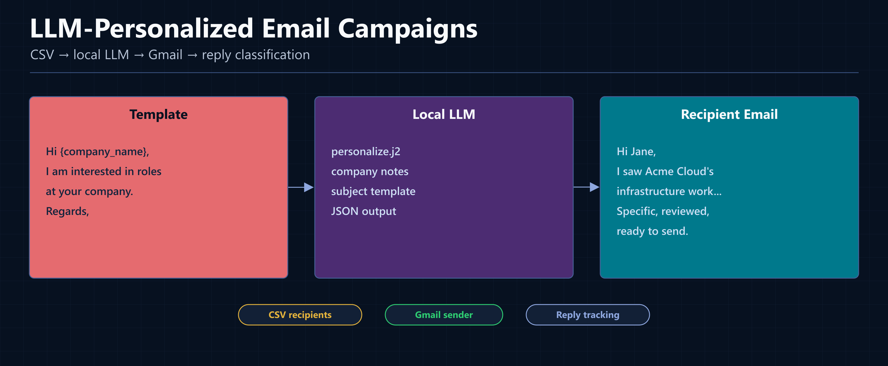
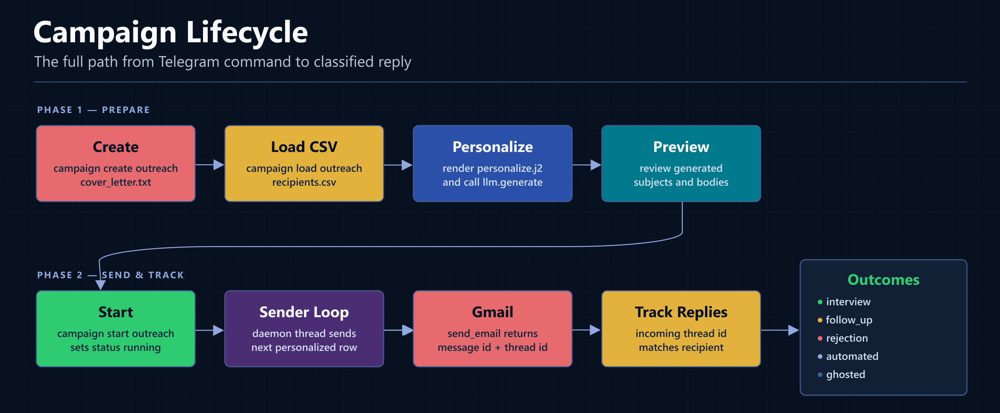
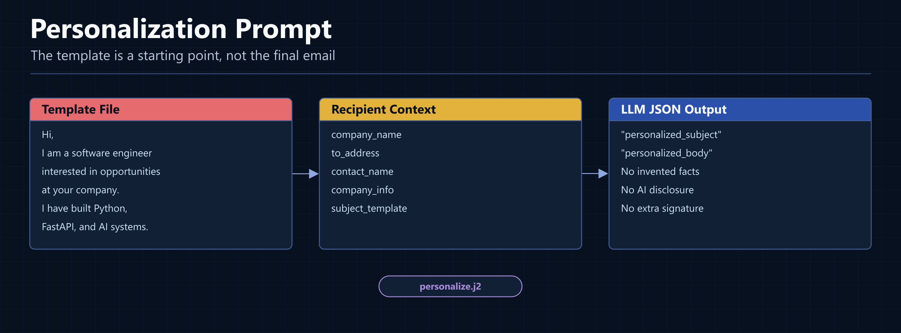
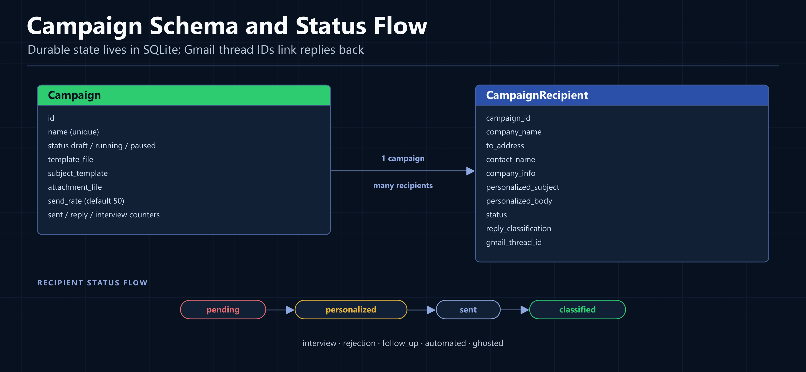
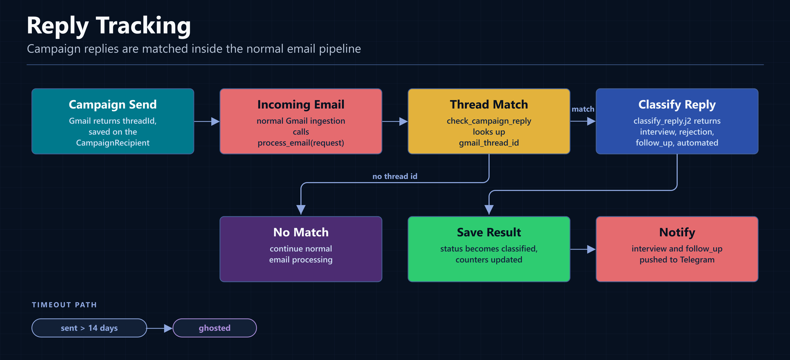

While standard mail merge tools simply swap tags like {first_name} into a static template and call it personalization, small outreach campaigns need a far more authentic approach. By combining a company name, optional contact details, and specific company notes, a system powered by a local LLM can naturally rewrite the entire body of each email for every individual recipient - delivering truly custom outreach rather than just filled-in placeholders.

This is the final major module in my local email agent series: a campaign engine that loads recipients from CSV, personalizes messages with Llama 3.1, sends through Gmail at a controlled rate, and classifies replies when they come back.

If you missed the earlier articles:

[Part 1: From Inbox to Character: Creating a Private, Local AI Email Agent](/articles/private-local-ai-email-agent)

[Part 2: How `/search` and `/ask` Work: Local Hybrid RAG with ChromaDB + SQLite FTS5](/articles/local-hybrid-rag-chromadb-sqlite-fts5)

[Part 3: LLM as Router: Intent Classification for a Local Telegram Email Agent](/articles/llm-as-router-intent-classification)

[Part 4: Implementation Lessons: Hidden Headaches of a Local Gmail AI Agent](/articles/hidden-headaches-local-gmail-ai-agent)

In this article, I will walk through the campaign system in the codebase:

- Telegram commands for campaign control
- CSV recipient loading
- Jinja2 prompt rendering
- LLM personalization
- SQLite campaign state
- Gmail sending with throttling
- reply matching by Gmail `threadId`
- LLM reply classification
- Telegram notifications for useful replies

---

## The Campaign Layer



_The campaign layer turns a CSV and a template into personalized Gmail messages, then tracks replies through the normal email ingestion pipeline._

The campaign code lives mostly in three files:

```text
webservice/src/email_service/services/cmd_campaign.py
webservice/src/email_service/services/campaign_engine.py
webservice/src/email_service/services/campaign_sender.py
```

The split is intentional:

- `cmd_campaign.py` parses Telegram commands and validates command arguments.
- `campaign_engine.py` creates campaigns, loads recipients, calls the LLM, previews messages, and classifies replies.
- `campaign_sender.py` runs in the background, finds running campaigns, sends the next ready recipient, and checks for ghosted recipients.

The campaign module uses the same design pattern as the rest of the app: Telegram is only the control surface. The actual work happens in service modules behind it.

---

## The User Flow



_A campaign moves from setup, to personalization, to throttled sending, to reply classification._

The command flow looks like this:

```text
campaign create outreach cover_letter.txt Role at {company_name}
campaign load outreach recipients.csv
campaign personalize outreach
campaign preview outreach
campaign start outreach
campaign status
campaign results outreach
```

Those commands can be sent through Telegram with or without a leading slash. The router treats `campaign` as a direct compound command namespace, so `campaign preview outreach` bypasses the LLM route and goes straight to the campaign handler.

Natural language can also work. The intent classifier knows campaign intents such as `campaign_create`, `campaign_load`, `campaign_personalize`, `campaign_preview`, `campaign_start`, `campaign_pause`, `campaign_resume`, `campaign_status`, and `campaign_results`.

The direct command path is faster and more predictable. The natural language path is useful when I type something like:

```text
start the outreach campaign
```

The LLM classifies that request, extracts the campaign name, and dispatches to the same underlying handler.

---

## Campaign Creation

The Telegram command handler is simple and small:

```python
def campaign_create(args: list[str]) -> str:
    if len(args) < 2:
        return (
            "Usage: campaign create (name) (template_file) [subject_template]\n"
            "Example: campaign create winter2026 cover_letter.txt "
            "'Application for {company_name}'"
        )

    name = args[0]
    template_file = args[1]
    subject_template = " ".join(args[2:]) if len(args) > 2 else None

    return campaign_engine.create_campaign(name, template_file, subject_template)
```

The engine checks that the template file exists in the configured campaign directory:

```python
template_path = settings.campaigns_dir / template_file
if not template_path.exists():
    return f"Template not found: {template_path}"
```

Then it creates a `Campaign` row:

```python
campaign = Campaign(
    name=name,
    template_file=template_file,
    subject_template=subject_template,
    attachment_file=attachment_file,
)
session.add(campaign)
session.commit()
```

The default campaign directory is:

```python
campaigns_dir: Path = Path("campaigns")
```

That keeps campaign templates, CSV files, and optional attachments out of the code.

---

## Loading Recipients from CSV

The CSV loader accepts a path directly, or a filename inside the campaign directory:

```python
csv_file = Path(csv_path)
if not csv_file.exists():
    csv_file = settings.campaigns_dir / csv_path
    if not csv_file.exists():
        return f"CSV not found: {csv_path}"
```

The expected CSV fields are simple:

```csv
company_name,to_address,contact_name,company_info
Acme Cloud,hr@example.com,Jane Smith,"Cloud infrastructure provider"
Northstar Labs,jobs@example.com,,"AI tooling for internal operations"
```

In practice, `company_name` and `to_address` are the minimum useful fields. `contact_name` and `company_info` are optional, but they are what make personalization better.

The loader stores each row as a `CampaignRecipient`:

```python
recipient = CampaignRecipient(
    campaign_id=campaign.id,
    company_name=row.get("company_name", ""),
    to_address=row.get("to_address", ""),
    contact_name=row.get("contact_name") or None,
    company_info=row.get("company_info") or None,
)
session.add(recipient)
```

Then it updates the campaign counter:

```python
campaign.total_recipients = count
session.commit()
```

---

## Personalization Prompt



_The template is rendered into a prompt with recipient context, then the local LLM returns a personalized subject and body._

The personalization step starts by reading the template file:

```python
template_path = settings.campaigns_dir / campaign.template_file
template_body = template_path.read_text(encoding="utf-8")
subject_template = campaign.subject_template
```

Then each pending recipient gets rendered through `personalize.j2`:

```jinja2
Personalize this email template for a specific recipient.
You are Sable, assisting with personalized outreach. Keep the result natural and specific.

--- TEMPLATE ---
{{ template_body }}
--- END TEMPLATE ---

Recipient details:
- Company: {{ company_name }}
- Email: {{ to_address }}
- Contact person: {{ contact_name }}
- About the company: {{ company_info }}


Subject template: {{ subject_template }}


Rules:
- Rewrite the template naturally for this specific recipient
- Use the company name and contact name where appropriate
- Incorporate the company info to show genuine knowledge of the company
- Keep the same tone, length, and intent as the original template
- Do not invent facts not provided in the recipient details
- Do not mention being an AI or assistant
- Do not add a signature (the user will add their own)

Return ONLY valid JSON:
{
    "personalized_subject": "The subject line for this recipient",
    "personalized_body": "The full personalized email body"
}
```

The actual call is the same pattern used everywhere else in the project:

```python
prompt = _personalize.render(
    template_body=template_body,
    company_name=rd["company_name"],
    to_address=rd["to_address"],
    contact_name=rd["contact_name"],
    company_info=rd["company_info"],
    subject_template=subject_template,
)

raw = llm.generate(prompt)
parsed = parse_json(raw)
```

Then the row is updated:

```python
r.personalized_subject = parsed.get("personalized_subject", "")
r.personalized_body = parsed.get("personalized_body", "")
r.status = "personalized"
session.commit()
```

That `status = "personalized"` transition is important. The sender only sends recipients in that state, so previewing before sending is easy.

---

## Preview Before Sending

Before starting a campaign, I can preview the generated messages:

```text
campaign preview outreach
campaign preview outreach 5
```

The preview command queries personalized recipients:

```python
recipients = (
    session.query(CampaignRecipient)
    .filter_by(campaign_id=campaign.id, status="personalized")
    .limit(count)
    .all()
)
```

Then it returns the subject and body for each selected row:

```python
for i, r in enumerate(recipients, 1):
    lines.append(f"--- #{i}: {r.company_name} ({r.to_address}) ---")
    lines.append(f"Subject: {r.personalized_subject}")
    lines.append(f"{r.personalized_body}\n")
```

This is intentionally plain text because Telegram is the review surface.

---

## Database State



_The campaign tables separate campaign-level counters from per-recipient state._

The database model has one campaign row and many recipient rows:

```python
class Campaign(Base):
    __tablename__ = "campaigns"

    id = Column(Integer, primary_key=True, autoincrement=True)
    name = Column(String, nullable=False, unique=True)
    status = Column(String, nullable=False, default="draft")
    template_file = Column(String, nullable=False)
    subject_template = Column(String)
    attachment_file = Column(String, nullable=True)
    send_rate = Column(Integer, default=50)

    total_recipients = Column(Integer, default=0)
    sent_count = Column(Integer, default=0)
    reply_count = Column(Integer, default=0)
    interview_count = Column(Integer, default=0)
    rejection_count = Column(Integer, default=0)
```

The recipient row stores personalization output and reply tracking data:

```python
class CampaignRecipient(Base):
    __tablename__ = "campaign_recipients"

    id = Column(Integer, primary_key=True, autoincrement=True)
    campaign_id = Column(Integer, ForeignKey("campaigns.id", ondelete="CASCADE"))
    company_name = Column(String, nullable=False)
    to_address = Column(String, nullable=False)
    contact_name = Column(String, nullable=True)
    company_info = Column(Text, nullable=True)

    personalized_subject = Column(String, nullable=True)
    personalized_body = Column(Text, nullable=True)

    status = Column(String, nullable=False, default="pending")
    reply_classification = Column(String, nullable=True)

    sent_at = Column(DateTime, nullable=True)
    replied_at = Column(DateTime, nullable=True)
    gmail_message_id = Column(String, nullable=True)
    gmail_thread_id = Column(String, nullable=True)
```

The practical recipient state flow is:

```text
pending -> personalized -> sent -> classified
```

The `reply_classification` field then tells me what kind of final state it is:

```text
interview | rejection | follow_up | automated | ghosted
```

The model comment also leaves room for a separate `replied` state, but the current implementation moves matched replies directly to `classified`.

---

## Throttled Sending

The sender starts automatically when the FastAPI app starts:

```python
@asynccontextmanager
async def lifespan(app: FastAPI):
    init_db()
    init_vectorstore()
    recover_stale_jobs()
    send_scheduler.start_scheduler()
    campaign_sender.start_sender()
    yield
    send_scheduler.stop_scheduler()
    campaign_sender.stop_sender()
```

The sender itself is a daemon thread:

```python
def start_sender():
    global _thread
    if _thread and _thread.is_alive():
        logger.warning("Campaign sender already running")
        return

    _stop_event.clear()
    _thread = threading.Thread(target=_sender_loop, daemon=True)
    _thread.start()
```

On each loop, it processes running campaigns and checks for ghosted recipients:

```python
def _sender_loop():
    while not _stop_event.is_set():
        try:
            _process_running_campaigns()
            _check_ghosted()
        except Exception as e:
            logger.error(f"Campaign sender error: {e}")

        _stop_event.wait(timeout=settings.campaign_check_interval)
```

The sender finds campaigns with `status == "running"`:

```python
campaigns = session.query(Campaign).filter(Campaign.status == "running").all()
```

For each campaign, it sends the next recipient with `status == "personalized"`:

```python
recipient = (
    session.query(CampaignRecipient)
    .filter_by(campaign_id=campaign_id, status="personalized")
    .first()
)
```

If there are no personalized recipients left, the campaign is complete:

```python
if not recipient:
    campaign = session.query(Campaign).get(campaign_id)
    if campaign:
        campaign.status = "completed"
        session.commit()
    return
```

Otherwise it sends through the Gmail client:

```python
sent = gmail_client.send_email(
    service,
    to=to_address,
    subject=subject,
    body=body,
    attachment_path=attachment_path,
)
```

Then it saves Gmail's returned IDs:

```python
r.status = "sent"
r.sent_at = datetime.now()
r.gmail_message_id = sent.get("id")
r.gmail_thread_id = sent.get("threadId")

campaign = session.query(Campaign).get(campaign_id)
campaign.sent_count += 1
session.commit()
```

The throttle is controlled by `send_rate`:

```python
delay = 3600 / send_rate
```

The current model default is 50 emails per hour, which works out to 72 seconds between sends:

```text
3600 / 50 = 72
```

The sender waits through `_stop_event.wait(timeout=delay)` instead of plain `time.sleep(...)`, so shutdown can interrupt the wait quickly.

---

## Reply Tracking



_Campaign replies are processed through the standard Gmail ingestion path and matched by thread ID rather than being handled by a separate inbox._

When a campaign email is sent, Gmail returns a `threadId`. The campaign sender saves that as `gmail_thread_id` on the recipient row.

Later, when an email comes in through the normal processing pipeline, `email_processor.py` checks the incoming Gmail thread:

```python
if request.thread_id:
    try:
        campaign_engine.check_campaign_reply(
            request.thread_id, request.body_text or ""
        )
    except Exception as e:
        logger.warning(f"Campaign reply check failed: {e}")
```

The campaign engine looks for a matching recipient:

```python
recipient = (
    session.query(CampaignRecipient)
    .filter_by(gmail_thread_id=thread_id)
    .first()
)
if not recipient:
    return None
```

If it finds one, it renders `classify_reply.j2`:

```jinja2
Classify this email reply to a campaign message.
You are Sable, a private local email agent. Be precise and conservative.

Campaign was sent to: {{ company_name }} ({{ contact_name }})
Recipient email: {{ to_address }}

Reply body:
{{ reply_body }}

Classification:
- interview: Positive response - invitation to interview, call, meeting, or next steps
- rejection: Negative response - position filled, not a fit, no openings
- follow_up: Neutral - asking for more info, clarifying questions, requesting documents
- automated: Auto-reply - out of office, delivery notification, "we received your application"

Return ONLY valid JSON:
{
    "classification": "interview | rejection | follow_up | automated",
    "confidence": "high | medium | low",
    "summary": "one sentence summary of the reply"
}
```

Then the classification is saved:

```python
r.status = "classified"
r.reply_classification = classification
r.replied_at = datetime.now()

campaign = session.query(Campaign).get(campaign_id)
campaign.reply_count += 1
if classification == "interview":
    campaign.interview_count += 1
elif classification == "rejection":
    campaign.rejection_count += 1

session.commit()
```

The agent only pushes Telegram notifications for replies that need attention:

```python
if classification in ("interview", "follow_up"):
    telegram_notifier.notify(
        f"Campaign reply from {company_name}!\n"
        f"Classification: {classification}\n"
        f"Summary: {summary}"
    )
```

That gives me a useful split:

- `interview` and `follow_up` are pushed immediately.
- `rejection` and `automated` are stored in results but do not interrupt me.
- `ghosted` is assigned later by the sender loop when no reply arrives.

---

## Ghosted Detection

The sender loop also checks old sent recipients:

```python
cutoff = datetime.now() - timedelta(days=14)
ghosted = (
    session.query(CampaignRecipient)
    .filter(
        CampaignRecipient.status == "sent",
        CampaignRecipient.sent_at < cutoff,
    )
    .all()
)
```

Each match is marked as classified and ghosted:

```python
for r in ghosted:
    r.status = "classified"
    r.reply_classification = "ghosted"

session.commit()
```

This is simple, but useful. Campaign results do not stay ambiguous forever. After 14 days, the system marks non-responses explicitly.

---

## Results

The campaign status view is compact in general:

```python
lines.append(
    f"  {c.name} [{c.status}] - "
    f"{c.sent_count}/{c.total_recipients} sent, "
    f"{c.reply_count} replies, "
    f"{c.interview_count} interviews"
)
```

Detailed results show aggregate counters:

```python
lines = [
    f"Results for '{name}' [{campaign.status}]:\n",
    f"  Total: {campaign.total_recipients}",
    f"  Sent: {campaign.sent_count}",
    f"  Replies: {campaign.reply_count}",
    f"  Interviews: {campaign.interview_count}",
    f"  Rejections: {campaign.rejection_count}",
]
```

Then it lists classified recipients:

```python
replied = (
    session.query(CampaignRecipient)
    .filter_by(campaign_id=campaign.id)
    .filter(CampaignRecipient.reply_classification.isnot(None))
    .all()
)

for r in replied:
    lines.append(f"  {r.company_name} - {r.reply_classification}")
```

This is enough for the Telegram agent. If I later add a dashboard, this same data can drive charts.

---

## Why Not Use Mailchimp?

For newsletters, I would use a real email marketing platform.

For small, careful outreach, this system has different priorities:

| Feature         | This local system                    | Mailchimp / SendGrid        |
| --------------- | ------------------------------------ | --------------------------- |
| Personalization | LLM rewrites each email              | Mostly template variables   |
| LLM privacy     | Runs locally                         | Usually cloud workflow      |
| Sending         | Gmail account                        | Marketing platform          |
| Reply tracking  | Gmail thread ID + LLM classification | Platform-specific analytics |
| Review flow     | Telegram preview before send         | Web UI                      |
| Scale           | Small campaigns                      | Large campaigns             |

The tradeoff is obvious: this is not a newsletter platform. It does not solve deliverability, list management, HTML templates, unsubscribe compliance, or large-scale analytics.

What it does well is small-batch outreach where every email should feel handwritten and where I want the LLM running locally.

---

## What This Module Taught Me

The campaign system looks more complex than the earlier features, but it is mostly the same patterns repeated:

- command handlers stay thin
- Jinja2 templates keep prompts visible
- local LLM calls return JSON
- SQLite stores durable state
- background threads poll for work
- Gmail API calls happen in one client module
- incoming email processing checks for campaign replies

The most important design choice was saving Gmail `threadId` after send. Without that, reply tracking would be fragile. With it, a campaign reply is just another incoming email that happens to match a recipient row.

That is the shape I like for local automation: small modules, boring state, and explicit handoffs between steps.

The full stack is still the same:

```text
Telegram -> FastAPI -> SQLite -> Gmail API
                 |
                 +-> llama.cpp
```

The LLM handles writing and classification, but standard Python code retains full control of the workflow.

That makes the system easier to debug, easier to extend, and much less mysterious when something goes wrong.

The code is here:
[github.com/sviat-barbutsa/llamail](https://github.com/sviat-barbutsa/llamail)
