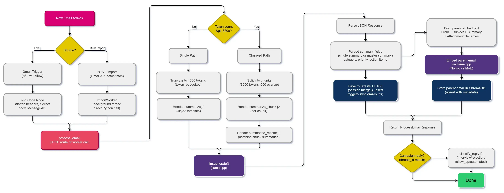
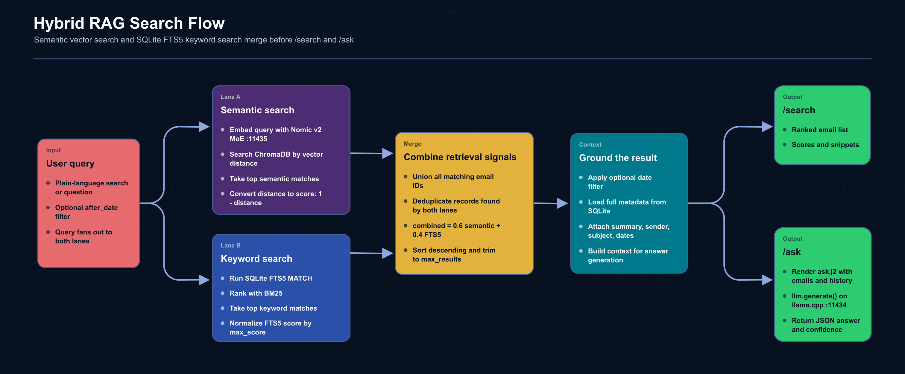
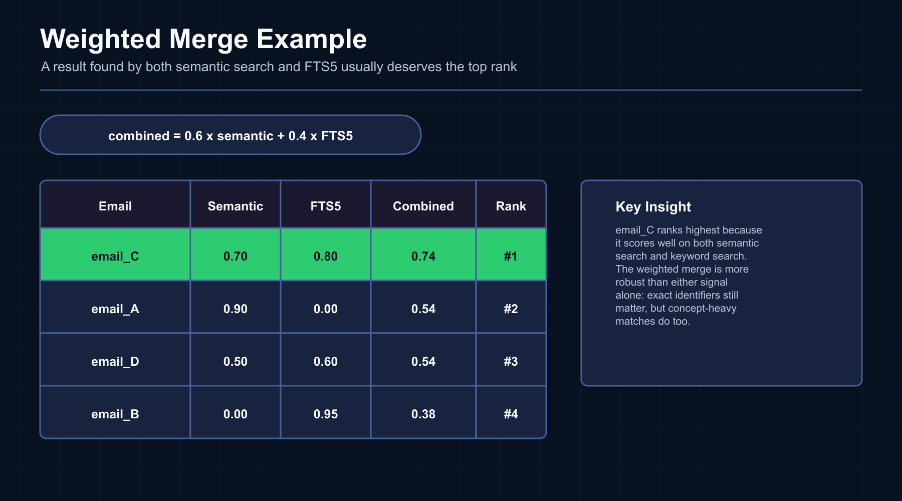

<!-- Originally published on dev.to: https://dev.to/sviat_barbutsa/how-search-and-ask-work-local-hybrid-rag-with-chromadb-sqlite-fts5-226c -->

_This is the second article in a five-part series about building Llamail, a private local AI email agent._

In the first article, I showed the whole system behind it: Gmail, Telegram, n8n, FastAPI, llama.cpp, SQLite, and ChromaDB. From the user's side it looked simple: type `/search`, get useful hits; ask a follow-up question in plain English, get an answer back; do it all from a phone. Quite convenient actually.

This article is about how all of that works under the hood. It will be interesting so let's dive in.

Pure semantic search is great at meaning. But ask it for exact tokens like a sender name plus invoice number, and it will often return emails that are vaguely about invoices while missing the exact identifier that mattered.

Pure keyword search has the opposite problem. It is strong on exact terms, sender tokens, and IDs, then falls apart when the query is conceptual: `budget`, `financials`, `spending plan`, `Q2 numbers`.

So I do both like this: every query goes into ChromaDB semantic retrieval and SQLite FTS5 keyword search, then the results are merged with a tiny weighted scoring function. The idea is related to rank-fusion techniques like RRF - Reciprocal Rank Fusion, which I will cover in separate article as it's quite useful, but this implementation is simpler: it merges normalized scores instead of reciprocal ranks. On my `18,000+` email mailbox, that gets me roughly `~3 seconds` for search and `~7 seconds` for full RAG Q&A, all on my average consumer laptop.

If you missed part 1, start there first:
[From Inbox to Character: Building a Private, Local AI Email Agent](/articles/private-local-ai-email-agent)

---

## What This Feels Like from Telegram

From the outside, the flow is simple. I type `/search budget` and get a ranked list of emails. Then I ask something like `what did John say about the budget?` and the agent answers with sources. In article 1, that looked like a straightforward chat interface. Under the hood, though, those two commands are doing different amounts of work.

`/search` only needs retrieval. `/ask` runs retrieval too, but then turns the top results into constrained context for one more LLM call. The reason both commands feel useful instead of gimmicky is that retrieval is hybrid: semantic search handles meaning, and keyword search handles exact matches.

---

## Why Single-Mode Search Breaks

Semantic search fails in predictable ways. It is good at meaning, but bad at exactness. If the user searches for an email address, an invoice number, a project code, or a sender name that really matters, embeddings can blur those details away. `About invoices` is not the same as `from john@acme.com about invoice`.

Keyword search fails just as predictably in the other direction. FTS5 is excellent at exact terms, but it has no idea that `budget`, `financials`, `spending plan`, and `Q2 numbers` are probably the same conversation. It also struggles with higher-level questions like `what did John think about the proposal?` unless the exact wording appears in the mailbox.

There is another failure mode that matters for RAG: aggregate questions. If someone asks `how many spam emails did I get last week?`, retrieval alone cannot answer that reliably, because `/ask` only sees the top few matching emails instead of scanning the full mailbox. The prompt explicitly tells the model to say that it only has a limited sample.

The fix is dead simple: run both search modes, normalize both score types into roughly the same range, merge them, and let the strengths of one compensate for the weaknesses of the other.

---

## The Shape of the Pipeline



_The diagram is dense a bit, so I also added a full-size version for readability:_
[Open full-size diagram](https://media2.dev.to/dynamic/image/width=1600%2Cheight=%2Cfit=scale-down%2Cgravity=auto%2Cformat=auto/https%3A%2F%2Fdev-to-uploads.s3.amazonaws.com%2Fuploads%2Farticles%2F5gyb17qxwa6qgsomb9q0.webp)

The bigger system still starts with email ingestion: live Gmail events or bulk import come in, the system summarizes the email and stores structured data in SQLite. In the single-email path, that same pass writes curated vector text into ChromaDB. In the chunked path, the system summarizes each chunk, creates a master summary, and writes one parent email embedding from that master summary. Search only works because the processing pipeline already did the cleanup work up front.

That is one of the reasons the Telegram experience in article 1 feels so lightweight. Most of the expensive thinking happened earlier, when the email entered the system.

---

## What I Actually Embed

The vector side of the system is intentionally small. Instead of embedding raw emails blindly I implemented a curated representation first and then send that to the embedding model.

This is the shared parent-email embedding text builder:

```python
# webservice/src/email_service/services/email_processor.py
def _build_embed_text(request: ProcessEmailRequest, summary: str | None) -> str:
    embed_text = (
        f"From: {request.from_name or 'Unknown'}\n"
        f"Subject: {request.subject}\n"
        f"Summary: {summary or ''}"
    )
    if request.attachments:
        filenames = ", ".join(a["filename"] for a in request.attachments)
        embed_text += f"\nAttachments: {filenames}"
    return embed_text
```

The key decision is that I embed the LLM summary instead the raw body. For normal emails, that is the direct summary. For long emails, it is the master summary created after chunking. That keeps the vector text semantically dense and strips out a lot of email garbage: signatures, disclaimers, nested reply chains, boilerplate greetings, and formatting noise. I also append attachment filenames so queries like `the email with the budget spreadsheet` still have a chance to hit.

The ChromaDB wrapper is correspondingly small:

```python
# webservice/src/email_service/services/embeddings.py
def store(doc_id: str, text: str, metadata: dict | None = None):
    vector = embed(text)
    _collection.upsert(
        ids=[doc_id], embeddings=[vector], documents=[text], metadatas=[metadata or {}]
    )

def search(query: str, n_results: int = 5, where: dict | None = None) -> list[dict]:
    vector = embed(query)
    kwargs = {"query_embeddings": [vector], "n_results": n_results}

    if where:
        kwargs["where"] = where

    results = _collection.query(**kwargs)
```

And the collection setup is just:

```python
_client = chromadb.PersistentClient(path=str(settings.chroma_path))
_collection = _client.get_or_create_collection(
    name="emails", metadata={"hnsw:space": "cosine"}
)
```

The embedding model is Nomic Embed v2 MoE, served by a separate llama.cpp instance on it's dedicated port. That split matters actually. Embedding requests do not block text generation on the main LLM server, so `/ask` and summarization are not competing for the same process which is really good for performance and the overall smooth experience.

Worth noticing that the chunked emails currently get one parent embedding from the master summary. I do not embed every individual chunk yet. That keeps the architecture simpler while still making long emails visible to semantic search. I think overengineering is one of the most common problems in software engineering and I'm definitely not immune to it, huh, so I try to keep that in mind.

---

## The Keyword Side: SQLite FTS5

The exact-match side of the pipeline is simple SQLite FTS5. I didn't see any need for Elasticsearch, or Meilisearch, or any separate search service. Just a virtual table living next to the relational data. My general principle is: keep it simple, yet still satisfy the business requirements.

```sql
CREATE VIRTUAL TABLE IF NOT EXISTS emails_fts USING fts5(
    subject, body_text, summary, from_name, from_address,
    content='emails', content_rowid='rowid'
);

CREATE TRIGGER IF NOT EXISTS emails_ai AFTER INSERT ON emails BEGIN
    INSERT INTO emails_fts(rowid, subject, body_text, summary, from_name, from_address)
    VALUES (new.rowid, new.subject, new.body_text, new.summary, new.from_name, new.from_address);
END;
```

The full database setup also includes matching delete/update triggers plus a `rebuild_fts()` helper for one-time backfills:

```python
def rebuild_fts():
    """Backfill FTS5 index from existing emails. One-time catch-up."""
    session = get_session()
    try:
        session.execute(text("INSERT INTO emails_fts(emails_fts) VALUES ('rebuild')"))
        session.commit()
    finally:
        session.close()
```

Why FTS5 is the right level of boring here:

- Zero infrastructure because it's built into SQLite.
- There is no additional network calls, or extra service handling, or any additional deploy.
- WAL mode gives concurrent reads and writes.
- For a mailbox this size, the exact-match lookup itself is cheap. The slower part of overall `/search` is usually local embedding inference and, for `/ask`, the final answer generation.

This is the FTS query:

```python
# webservice/src/email_service/services/search.py
rows = session.execute(
    text(
        """
         SELECT e.id, -fts.rank AS score
         FROM emails_fts fts
         JOIN emails e on e.rowid = fts.rowid
         WHERE emails_fts MATCH :query
         ORDER BY fts.rank
         LIMIT :limit
    """
    ),
    {"query": query, "limit": limit},
).fetchall()
```

In this query, `fts.rank` is ordered lower-is-better, so I sort by the raw rank but expose `-fts.rank` as a positive score. Then I normalize it to the `0-1` range so it can be mixed with semantic scores cleanly.

One nuance: this version passes the query string directly into FTS5. That works well for normal words, but punctuation-heavy searches like raw email addresses or invoice numbers may need a small escaping or tokenization step. If FTS5 rejects the query, the code logs the failure and still returns semantic results instead of breaking the Telegram command.

---

## The Merge That Makes It Work

The merge algorithm is the part I like most because it is so small relative to how useful it feels in practice.



In the code, the full hybrid search function is small:

```python
# webservice/src/email_service/services/search.py
def hybrid_search(
    query: str,
    max_results: int = 10,
    account_id: str | None = None,
    after_date: datetime | None = None,
) -> list[dict]:
    semantic_hits = _semantic_search(query, n=max_results * 2, account_id=account_id)
    fts_hits = _fts_search(query, limit=max_results * 2)
    merged = _merge_results(semantic_hits, fts_hits, max_results * 2)
    return _enrich(merged, max_results=max_results, after_date=after_date)
```

And here is the actual merge:

```python
def _merge_results(
    semantic: dict[str, float], fts: dict[str, float], max_results: int
) -> list[tuple[str, float]]:
    all_ids = set(semantic) | set(fts)

    SEMANTIC_WEIGHT = 0.6
    FTS_WEIGHT = 0.4

    scored = []
    for email_id in all_ids:
        s = semantic.get(email_id, 0.0) * SEMANTIC_WEIGHT
        f = fts.get(email_id, 0.0) * FTS_WEIGHT
        scored.append((email_id, s + f))

    scored.sort(key=lambda x: x[1], reverse=True)
    return scored[:max_results]
```

That is basically the whole trick.

Why `60/40`?

- Semantic search should dominate for concept-heavy questions.
- FTS should still have enough weight to pull exact identifiers upward.
- Emails found by both methods nearly always deserve to float to the top.
- Fetching `2x` the final limit from each source before trimming prevents one source from crowding out the other too early.

That's basically it and there is no fancy reranker or some fusion layer after that. Only two signal sources, a weighted sum, and a sort. Remember: simple yet functional.

A concrete scoring example makes the behavior easier to see. If `email_A` scores `0.90` in semantic search and `0.00` in FTS5, the combined score is `0.54`. If `email_B` scores `0.00` in semantic search and `0.95` in FTS5, the combined score is `0.38`. But if `email_C` scores `0.70` in semantic search and `0.80` in FTS5, the combined score is `0.74`, so the result found by both systems wins.



---

## From Ranked Results to RAG Answers

This is the point where article 1's two user-visible commands start to diverge.

`/search` only needs ranked results. `/ask` goes one step further: it takes those search hits, renders them into a prompt, adds limited conversation history, and asks the local LLM for a JSON answer.

The current prompt template is:

```jinja2
Answer the user's question based ONLY on the email context below.
You are Sable, a private local email agent. Be calm, factual, and concise.
If the answer is not in the context, say "I don't have enough information in the available emails to answer that."
If the question asks to count, list totals, or compute statistics across all emails, explain that you can only see a limited sample of emails, not the full mailbox.


--- CONVERSATION HISTORY ---
{{ conversation_history }}
--- END HISTORY ---


--- EMAIL CONTEXT ---


[{{ loop.index }}] From: {{ email.from_name or "Unknown" }} <{{ email.from_address }}>
Subject: {{ email.subject or "(no subject)" }}
Date: {{ email.received_at }}
Summary: {{ email.summary or "(no summary)" }}
Attachments: {{ email.attachments }}


--- END CONTEXT ---

Question: {{ question }}

Return ONLY valid JSON:
{
    "answer": "Your answer here, referencing emails by [number] when relevant",
    "confidence": "high | medium | low"
}
```

Conversation history is stored in SQLite via the `ChatMessage` table for persistence. The helper in `chat_memory.py` pulls recent exchanges, then trims them again against a token budget before formatting them for the prompt.

In the current code:

- history is stored in SQLite
- the latest rows are loaded per `chat_id`
- history is capped at `settings.chat_history_limit * 2`, which works out to 20 rows by default, or about 10 user/assistant exchanges when the conversation alternates cleanly
- it is trimmed again to a `2,000` token budget before prompt rendering
- all Telegram exchanges are recorded, but only the `ask` and `chitchat` flows inject that history into an LLM prompt

**Note**: _For sure I could have used LangChain or LlamaIndex with a more elaborate multi-level memory system, but that would have added a lot of complexity for little benefit in this project. A small SQLite-backed memory window was efficient for my purpose._

That is enough for useful follow-ups:

- `What did John say about the budget?`
- `When was that?`
- `Did he mention attachments?`

The current context-budget reality is also quite modest:

- app context window setting: `8192`.
- chat history token budget: `2000`.
- `/ask` search result count: `5`.
- there is no separate explicit `max_output_tokens` setting in the current `ask()` path; the prompt keeps the task narrow instead.

So the system stays comfortably inside an 8k context window without pretending it has full-mailbox visibility which is extremely useful on common hardware.

---

## Small Details That Matter

The raw hybrid merge is not the whole story. Two practical details make the results feel much smarter.

**_Date filtering from natural language_**

For search-style messages, the intent classifier can turn relative time phrases into an ISO date:

```text
"emails from last week" -> after_date: "<computed ISO date>"
"since Monday"          -> after_date: "<computed ISO date>"
```

The important part is not the literal example value; it is rather the mechanism. `classify_intent.j2` gets `today` injected as a template variable, so the router can compute a real `after_date` before the search handler runs. In the current code, that date parameter is wired into the search flow; `/ask` still uses the top retrieved emails without a separate date-filter argument.

**_Source thresholding for `/ask`_**

The answer formatter hides weak sources:

```python
good_sources = [(i, r) for i, r in enumerate(results, 1) if r["score"] > 0.3]
if good_sources:
    lines.append(f"Sources ({len(good_sources)}):")
```

That tiny cutoff fixed an annoying behavior where broad or aggregate questions would dump obviously irrelevant citations just because they happened to be in the top five retrieved emails.

---

## Why I Like This Approach

Hybrid search is a good solution for the common RAG relevancy problems. The merge function is basically a handful of lines. But the improvement over semantic-only or keyword-only retrieval is dramatic.
SQLite FTS5 + ChromaDB, both embedded, running on one average machine, are enough to make 18,000+ emails genuinely searchable in a useful way.

In my setup that means about `~3 seconds` for search and about `~7 seconds` for full RAG Q&A. Slower than a cloud stack, obviously, but fast enough to be practical from Telegram on a phone. For my purposes it's perfectly fine.

If article 1 was the broad system tour, this is the subsystem that made the whole project feel real to me. Once search stopped acting like a demo and started returning the emails I actually meant, the rest of the agent suddenly had something solid to stand on.

Source code:
[github.com/sviat-barbutsa/llamail](https://github.com/sviat-barbutsa/llamail)

In the next article, I will move one layer up from retrieval and into the command layer: the LLM-as-router pattern that lets people talk to this system naturally instead of memorizing boring command syntax. Stay tuned!
