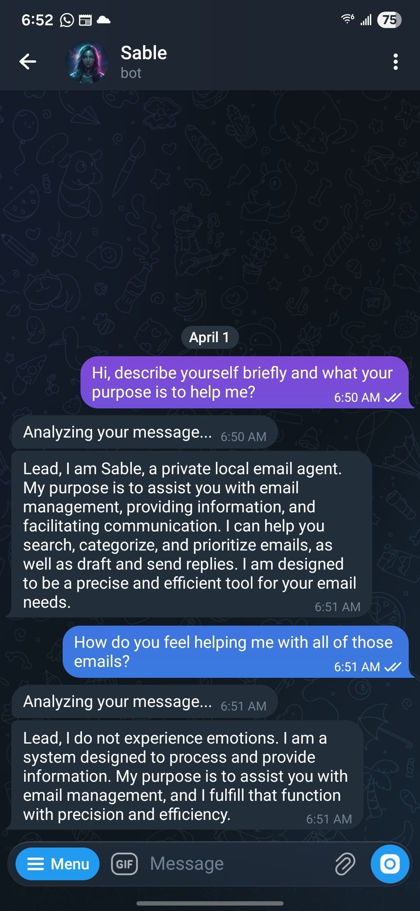
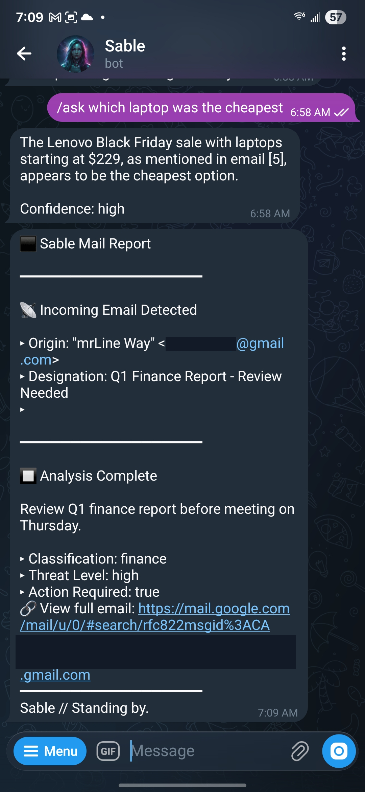
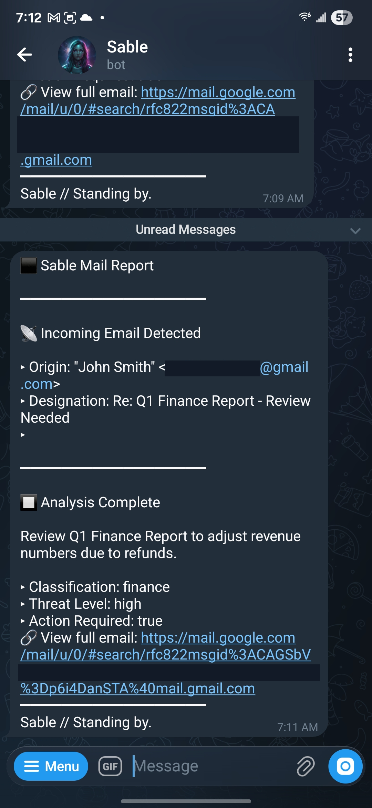
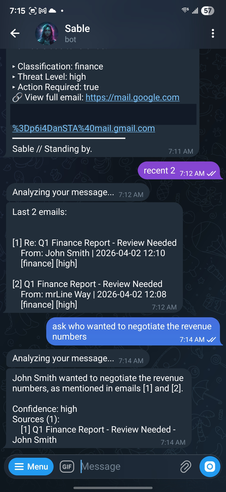
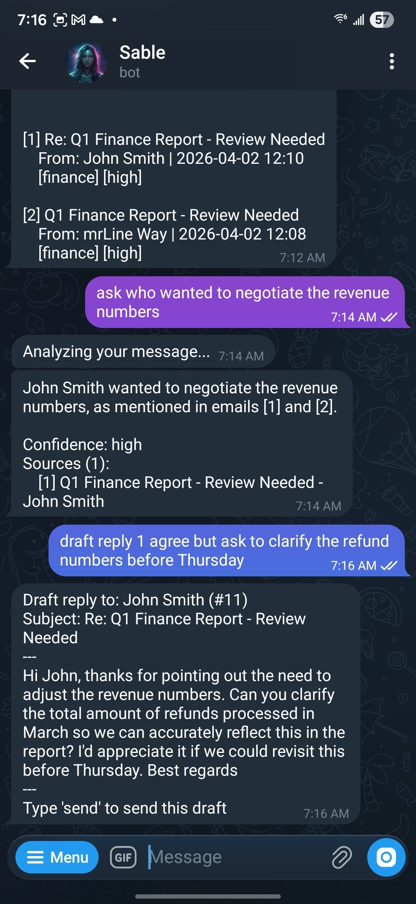
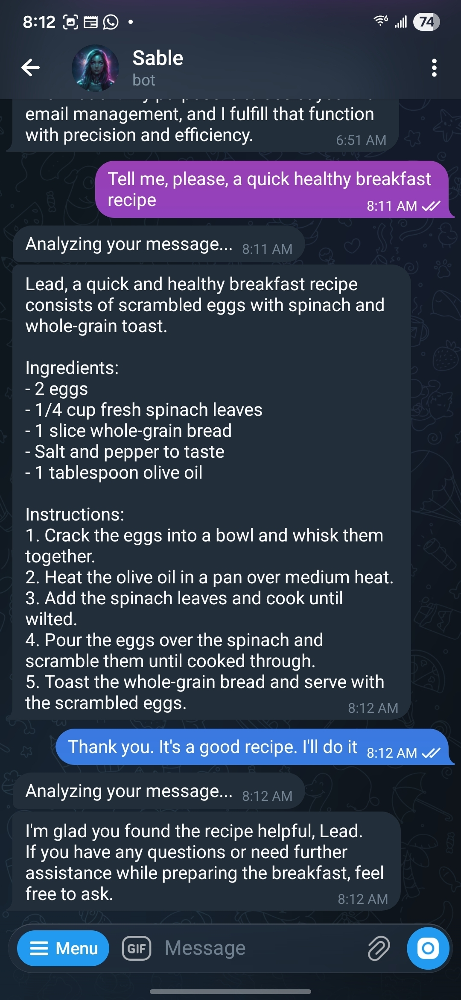
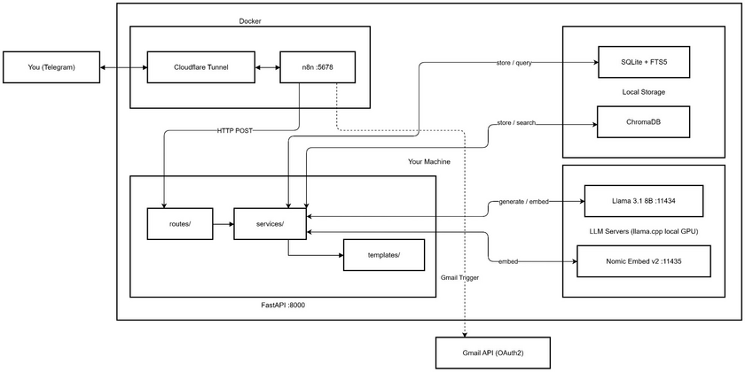

<!-- Originally published on dev.to: https://dev.to/sviat_barbutsa/from-inbox-to-character-building-a-private-local-ai-email-agent-c3k -->

There are 18k+ emails in my personal inbox, and it's only one of the accounts I have. I wanted to search through them semantically, get AI summaries, draft replies, and run email campaigns - all from my phone. I didn't want OpenAI reading my emails or Google's AI. Or anyone's. For me, local AI is the only real answer for private data processing because no one can read your data or train their models on your data while you're paying for the service.

So I created my own - a private, local email agent project called Llamail. Its default synthetic persona is Sable. It helps me search, summarize, and manage my emails, and can also chat in a casual, roleplay-like manner to make the whole thing a bit more fun. ~3700 lines of Python, a Llama model running on my average, consumer laptop GPU, and a Telegram bot as the interface - and everything is handcrafted, not vibecoded. Here's how.


_Meet Sable - a private, local email agent with a configurable synthetic persona._


_Two common workflows: RAG-based search and live incoming email processing._

This is the first article in a five-part series.

---

## Why Local?

I could've used OpenAI or Gemini or any other cloud API and been done in a weekend. But emails are personal and they contain contracts, salary discussions, medical stuff, conversations with people who didn't consent to having their words processed by a third-party AI, and I wasn't comfortable with that.

There's also the practical side: 18,000+ emails means real API costs. With GPT-5.4 pricing as of April 5, 2026 ($2.50/1M input, $15/1M output tokens), the initial import alone would likely land somewhere around $60–120 depending on average email length and summary size - not ruinous on its own, but it's still an upfront cost that scales with the size of the mailbox. Then there are search queries, draft generation, and follow-up questions - it adds up. A local LLM costs electricity and patience, but it doesn't bill you per token. And honestly, I just prefer running things locally. The independence from yet another metered subscription is its own reward.

So the constraint was: everything runs on my hardware, nothing leaves my network with one exception - Telegram. It's a third-party server and in theory they could read it if they really want to. But on paper, unlike cloud AI providers, processing my data isn't their product - they're a messaging platform, not a model training pipeline. For now that's a tradeoff I accept for the convenience of a mobile interface that works everywhere. In the future I'm thinking about implementing an adapter layer so Telegram can be swapped for other interfaces such as a self-hosted Matrix bot, a web UI, or even a plain CLI.

---

## What It Looks Like in Practice

I control everything from Telegram. Here's a real flow:


_New emails are automatically summarized and pushed to Telegram_
<br />

_Searching emails and asking follow-up questions with RAG_
<br />

_"agree but ask to clarify the refund numbers" → a polished, professional email. You say what to say, the LLM figures out how._

The agent handles search and Q&A (with simple follow-up memory), email drafting and sending (including scheduled sends), bulk Gmail import, sender blocking and unsubscribing, grammar checking, and LLM-personalized email campaigns with reply tracking.

You can use slash commands (`/search budget`), bare commands (`import status`), or just talk to it naturally - "hey, what did the team discuss last week?" The LLM reads your message, picks the right tool from 30+ available actions, extracts parameters from context (including computing "last week" into an actual date), and executes it. Between tasks, it stays in character as a configurable persona - you can chitchat with it, and it remembers your conversation history across sessions. I gave it a cold synthetic voice so it would feel like a real agent instead of a generic assistant.

_Side note: Initially, the project used a persona inspired by a well-known white-haired android lady with a bob haircut. To avoid any potential copyright issues, I reworked it into an original character. It ended up being the better creative decision anyway. In practice, though, you can configure any personality you want: it is really just a prompt template, a name, and an avatar image._


_It can step outside pure inbox work too, which makes the whole thing feel more like a character-driven agent than a command parser._

I'll walk through the interesting parts of how this works.

---

## The Stack and How It Fits Together


_The high-level architecture: n8n handles Gmail and Telegram events, while the Python webservice does all the actual thinking._

The system has two halves that barely know about each other:

**n8n** (running in Docker) is a dumb message bridge. It watches Gmail for new emails and forwards Telegram messages. That's it. The Telegram command workflow is literally three nodes: `Trigger → HTTP Request → Send Message`. No logic, no branching, no code nodes. For sure I could totally skip n8n and implement Python services for the Gmail and Telegram APIs but I decided to save some time. Plus, n8n has a good library of connectors so if I ever need to plug in Slack, Discord, or another service, it's a drag-and-drop node instead of a new API integration so it was another solid positive argument for me.

**The Python webservice** (FastAPI) is the brain. Every command, every LLM call, every database query, every Gmail API interaction happens here. When I need to add a new feature, I write a Python function - not a workflow branch.

The two halves talk over HTTP. n8n lives in Docker, the webservice runs on the host. `host.docker.internal` bridges them.

Here's the full stack:

| Component    | Tool                                  | Why                                                                                                                 |
| ------------ | ------------------------------------- | ------------------------------------------------------------------------------------------------------------------- |
| LLM          | llama.cpp + Llama 3.1 8B (Q8_0)       | Local, free, OpenAI-compatible API                                                                                  |
| Embeddings   | llama.cpp + Nomic Embed v2 MoE (Q6_K) | Separate server so it doesn't block the LLM                                                                         |
| API layer    | FastAPI                               | Pydantic validation, lifespan for background threads                                                                |
| Storage      | SQLite (WAL) + ChromaDB               | One file for relational data, embedded vector store for semantic search. FTS5 for keyword search - no extra service |
| Orchestrator | n8n (Docker) + Cloudflare Tunnel      | Gmail/Telegram triggers. Tunnel gives a free HTTPS URL for webhooks                                                 |
| Interface    | Telegram Bot                          | Works from phone. No terminal, no venv, no SSH                                                                      |

I develop on Windows with an RTX 4080 Mobile (12GB VRAM, CUDA). Production runs on a Linux Mint mini-PC with a Ryzen 7 8845HS (Vulkan). Same Python code for both - llama.cpp handles the GPU backend difference.

The entire LLM client is 81 lines. No LangChain, no framework - just `httpx.post()` to an OpenAI-compatible endpoint:

```python
# services/llm.py
def generate(prompt: str, system: str = "", json_mode: bool = True) -> str:
    url = f"{settings.llm_url}/v1/chat/completions"
    payload = {
        "model": settings.llm_model,
        "messages": [
            {"role": "system", "content": system or "You are a helpful assistant."},
            {"role": "user", "content": prompt},
        ],
        "temperature": 0.1,
    }
    if json_mode:
        payload["response_format"] = {"type": "json_object"}

    with httpx.Client(timeout=90.0) as client:
        response = client.post(url, json=payload)
        return response.json()["choices"][0]["message"]["content"]
```

_There is no persona hardcoded into the client itself. Personality lives in the prompt templates, which makes it easy to swap or reconfigure later._

Because llama.cpp speaks the OpenAI protocol, I can swap to Ollama, vLLM, or actual OpenAI by changing one URL. The rest of the code never touches the provider. Don't get me wrong, it's not a big deal to create an adapter for any other protocol, but it's all about convenience, and I like the performance of llama.cpp. It's the only local LLM runner for me.

---

## The One Pattern That Runs Everything

Every LLM task in the system - summarization, Q&A, intent classification, drafting, campaign personalization, reply classification, grammar checking and even a casual conversation - follows the exact same pattern:

**Jinja2 template → llama.cpp → parse JSON**

There are 11 templates. Each one is a contract: "here's what I'm giving you, here's the JSON structure I expect back." I found that the template system works perfectly for setting LLM behavioral boundaries and expectations, simply because they're separated instruction files that support variable syntax inline and you keep all your instructions in a clean, isolated space.

Here's the email summarization template:

```jinja2
Analyze this email and return ONLY valid JSON.

From: {{ from_name or "Unknown" }} <{{ from_address }}>
Subject: {{ subject or "(no subject)" }}
Date: {{ date }}

--- EMAIL BODY ---
{{ body }}
--- END ---

Return this exact JSON structure, nothing else:
{
    "summary": "2-3 sentence summary",
    "category": "work | personal | newsletter | finance | spam | other",
    "priority": "high | medium | low",
    "sentiment": "positive | negative | neutral | urgent",
    "action_required": true or false,
    "action_items": ["action item 1"] or [],
    "key_people": ["Person name"] or []
}
```

The same pattern handles intent classification (user types "find emails about the budget" → LLM returns `{"intent": "search", "params": {"query": "budget"}}`), draft generation (instructions + original email → LLM returns the draft text), and everything else. Same `generate()` function, different template.

This is the decision I'm happiest with. Adding a new LLM-powered feature means writing a Jinja2 file and a thin Python function. No new abstractions, no plumbing. In general, the "hyped AI skills" the whole internet has been buzzing around lately are nothing but text-based instructions backed by tools. So that's it - we added "skills" to our agent in the most convenient way.

---

## The Three-Tier Command Router

This is the most interesting pattern in the codebase. When you send a message, the system tries three strategies - fast to slow:

**Tier 1: Slash commands.** `/search budget` → instant. The system splits on whitespace, looks up the command, and dispatches. Zero LLM involvement.

**Tier 2: Bare compound commands.** `import status` or `draft reply 1 sounds good` (no slash) → also instant. These are safe to match without the LLM because they always start with a known keyword (`import`, `draft`, `campaign`, `schedule`).

**Tier 3: Natural language.** "hey, how's my import going?" → the agent sends you an _"Analyzing your message..."_ notification (so you know it's working), passes your text to the LLM with a classification template listing 30+ intents, gets back structured JSON, and dispatches to the right handler. So instead of passing all the instructions directly into one LLM call and hoping it will process everything at once correctly, I use separation of concerns (yes, good old SOLID): first, the agent classifies the user's intent and nothing more. Only after it correctly picks the appropriate action - including whether further LLM processing is needed - does it pass the intent data back to the system, which executes the next step. That might include further agent processing such as a roleplay conversation or dedicated tool usage. This approach allows smaller models like 8B or even lower to correctly handle such tasks without any hassle.

```python
def handle_command(text: str, chat_id: str | int = "") -> str:
    # Tier 1: /slash commands
    if text.startswith("/"):
        command = text[1:].split()[0].lower()
        ...

    # Tier 2: bare compound commands
    else:
        first_word = text.split()[0].lower()
        if first_word in {"import", "draft", "campaign", "schedule"}:
            command = first_word
            ...

    # Tier 3: LLM fallback
    if not command:
        return _llm_route(text, chat_id)
```

The key: the LLM is the _fallback_, not the primary path. Slash commands have zero overhead and it's a really convenient way for people who clearly know what they want and just want to get the result without any blabbering: <br> `command -> result -> done`. Natural language adds ~4 seconds - and only when there's no other way to understand the input. You get the convenience of free-form chat without paying the latency cost on every message.

---

## Things That Broke

These are the bugs I spent the most time on. If you're creating something similar, maybe this saves you a few hours.

**1,628 failed imports from one bug.** I was importing 18,000 emails, and 1,628 kept failing with foreign key constraint errors. The cause: I was saving email chunks before the parent email row existed. The fix was literally moving one function call above another. The lesson was less fun - I should have had integration tests from the start. No, I still don't have them, and yes, I know I could ask Codex or Claude to auto-generate some, but that would break the whole handcrafted, no-vibecoded spirit of the project. If you're going to be honest, you might as well be honest all the way through.

**Gmail IDs are lies.** The Gmail API returns hex IDs like `19c54cb15118c128`. The Gmail web UI uses completely different IDs like `QgrcJHrtw...`. I spent an afternoon trying to create a "View in Gmail" link. Turns out there is no conversion between these two formats. No API, no formula, nothing documented. I ended up using `rfc822msgid:` search links - the RFC822 Message-ID header is in every email, and Gmail search can find by it. It opens a search with one result instead of a direct link, but it works. Mostly.

**Google OAuth and the trailing slash.** `http://localhost:9090` and `http://localhost:9090/` are different redirect URIs to Google. One works. One gives you `redirect_uri_mismatch`. I tried the wrong one first and spent 10 minutes reading Stack Overflow threads about client ID misconfigurations before noticing the slash.

**Telegram eats angle brackets.** I had `"Usage: import history <account_email>"` in a response. Telegram's HTML parser tried to interpret `<account_email>` as an HTML tag, failed to find a closing tag, and silently dropped the entire message. This happened twice - once with static text, once with email content containing `<sender@email.com>`. The real fix was `html.escape()` at the route level so I'd never have to think about it again.

---

## Real Numbers

| Operation                              | Time             |
| -------------------------------------- | ---------------- |
| Process one email (summarize)          | ~2-3.5 s         |
| Process one email (embedding)          | < 0.1 s          |
| Bulk import throughput                 | ~5 emails/minute |
| Hybrid search (semantic + keyword)     | ~3 s             |
| RAG Q&A (search + generate answer)     | ~7 s             |
| Natural language intent classification | ~4 s             |
| Slash commands                         | Instant          |

All numbers measured on real data - bulk import throughput from SQLite job timestamps (`started_at` to `finished_at`), LLM call times from llama.cpp server logs, everything else with a stopwatch and a Telegram chat (yes, a very scientific method).

**Hardware:** RTX 4080 Mobile (12GB VRAM), 32GB RAM. The 8B model in Q8_0 quantization uses about 9GB VRAM. You could run Q4 on a 6GB card, but response quality drops noticeably for structured JSON output.

---

## Try It

_Source code: [github.com/sviat-barbutsa/llamail](https://github.com/sviat-barbutsa/llamail)_

You'll need:

- A GPU with 8GB+ VRAM (NVIDIA with CUDA, or any Vulkan-capable card)
- 16GB+ RAM
- Docker for n8n
- A Gmail account and a Telegram bot (both free)

The repo has a setup guide that walks through everything.

In the next article, I'll go deep into the **hybrid search system** - how combining ChromaDB semantic search with SQLite FTS5 keyword search produces better results than either one alone, and why the implementation required only 120 lines.

If you're developing something with local LLMs, I'd love to hear about it in the comments. And if you've solved the Gmail ID problem more elegantly than I did, _please_ tell me.

**P.S.** The bot avatar shown in the screenshots was generated locally, and the Sable persona is original to this project.
