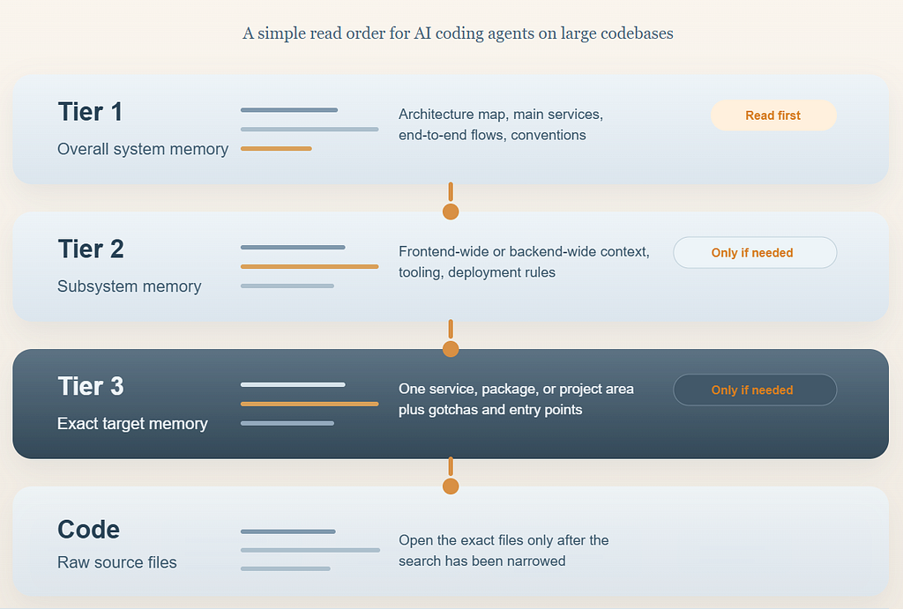

<!-- Originally published on Medium: https://medium.com/@sviatoslavbarbutsa/the-3-tier-memory-system-that-cut-my-ai-coding-context-by-96-469165635deb -->


I’ve been using AI for coding for a while, and the project I’m working on is large enough that the real bottleneck is not code generation but onboarding. Before an agent can fix a bug or implement a feature, it has to understand the system design, the architecture, and the relationships between services.

The naive solution is to let the agent scan the whole codebase. That works, but on a big system it is expensive and wasteful. You burn context just to re-establish orientation, and then you often have to do it again in later sessions. A single giant README.md, CLAUDE.md or AGENTS.md does not fully solve that either, because most tasks do not require the entire system at full detail. On my project, that would mean loading context for 16 backend microservices and 6 frontend projects even when the task only touches one small area.

Separate AI setup files help, but they create a new problem: the agent needs a high-level map and a local magnifying glass simultaneously. Without both, the system breaks down.

This is the real failure mode.

> _AI coding agents usually do not fail because they cannot write code; they fail because we introduce them to the codebase badly._

I realized this while watching an agent burn through thousands of tokens opening irrelevant files. It was doing the AI version of wandering through a maze without a map. By the time it finally explored its way to the right file, it had already exhausted its attention on the wrong things.

On a real codebase, that default workflow gets wasteful fast. The agent starts scanning, tries to orient itself from raw source, and still misses the things that matter most:

- **how the system fits together**
- **which part of the codebase is relevant**
- **project conventions**
- **cross-service flows**
- **known traps and sharp edges**

I ran into this with two large repos: a backend monorepo and a frontend monorepo so I changed the loading order.

Instead of letting Codex and Claude start from raw source, I implemented a **3-tier memory system**:

- **Tier 1**: overall system memory
- **Tier 2**: overall frontend or overall backend memory
- **Tier 3:** specific service, package, or project memory

Only after those layers does the agent open raw code.

That one change was enough to cut the initial context load by about **96%**.

I also created [a tiny demo repo for this pattern](https://github.com/sviat-barbutsa/ai-memory-tiers-demo) so the idea is easier to inspect in a small, public-friendly shape. The demo is intentionally simple: a tiny backend, a tiny frontend, and the same memory hierarchy described here.

```
ai-memory-tiers-demo/
|- backend/
|  `- api/
|- frontend/
|  `- web/
`- DOCS/
   `- MEMORY/
      |- MEMORY.md
      |- SYSTEM_ARCHITECTURE.md
      |- backend/
      `- frontend/
```

The point of that repo is not the app itself. The point is to make the memory pattern easy to see without reverse-engineering it from a production codebase.

## **The Actual Problem**

On small projects, raw exploration is usually fine.

On large systems, it becomes self-defeating.

If the model tries to read everything up front, three things happen:

1. It spends context budget on discovery instead of implementation.
2. It learns details before it learns structure.
3. By the time it starts writing, the early context is already diluted or compacted away.

That is why so many AI coding sessions feel inconsistent. The model may read a lot, but it still does not understand the project the way a senior engineer would.

A senior engineer does not start with 200 random files. They start by identifying:

- **what exists**
- **how it connects**
- **which area matters for this task**
- **which files are the real source of truth**

That is what the memory system is trying to preserve.

## **The 3 Tiers**



The rule is simple: start broad, then narrow.

For most non-trivial work, the agent should read **Tier 1 first**. If that is not enough, it moves down one level at a time.

### **_Tier 1: Overall System Memory_**

This is the map.

It explains:

- **what services and packages exist**
- **how they depend on each other**
- **the main conventions**
- **the important end-to-end flows**

Typical Tier 1 files look like this:

```
- MEMORY.md
- SYSTEM_ARCHITECTURE.md
- END_TO_END_FLOWS.md
- llm_workflow_guide.txt
```

Tier 1 gives the agent enough structure to stop guessing.

### **_Tier 2: Frontend-Wide or Backend-Wide Memory_**

This is the broad subsystem layer.

It explains the shape of one side of the stack:

- **backend monorepo structure**
- **frontend monorepo structure**
- **shared tooling**
- **deployment rules**
- **package or service-group conventions**

Examples:

```
- backend/TIER2_MEMORY.md
- frontend/monorepo_MEMORY.md
- frontend/DEPLOYMENT.md
- frontend/theming.md
```

Tier 2 is what you read when Tier 1 is not enough, but you still do not want to jump straight into one service or package.

### **_Tier 3: Specific Service or Project Memory_**

This is the detailed layer for the exact thing you are about to change.

It explains:

- **structure**
- **routing and entry points**
- **bindings and configuration**
- **domain modules**
- **database shape**
- **integrations**
- **gotchas**

Examples:

```
- NOTIFICATION_SERVICE__MEMORY.md
- REALTIME_GATEWAY__MEMORY.md
- SESSION_MANAGER__MEMORY.md
- WEB_APP_PACKAGE__MEMORY.md
- SHARED_FOUNDATION_PACKAGE__MEMORY.md
```

Only after Tier 3 does the agent go into raw source files.

That is the entire trick:

1. map first
2. subsystem next
3. source files last

## **What I Measured**

I did not want to rely on “it feels faster.”

So I measured the memory system against the actual repos using real tokenizers for both ecosystems.

**Methodology:**

- Memory corpus: every .md and .txt file in DOCS/MEMORY
- Repo corpora: every git-tracked text file in the backend and frontend repos
- Exclusions: binaries and dependency noise
- OpenAI/Codex tokenizer: tiktoken with o200k_base
- Claude tokenizer: @anthropic-ai/tokenizer
- Counting method: sum of per-file token counts across each corpus

**Here are the totals:**

- Memory system: 76 files, 384,994 OpenAI/Codex tokens, 436,091 Claude tokens
- Backend repo: 1,896 files, 3,195,863 OpenAI/Codex tokens, 3,465,905 Claude tokens
- Frontend repo: 2,735 files, 6,857,056 OpenAI/Codex tokens, 7,607,795 Claude tokens
- Backend + Frontend: 4,631 files, 10,052,919 OpenAI/Codex tokens, 11,073,700 Claude tokens

The most useful comparison is the last one.

If I let the agent treat both repos as the first layer of context, it has to deal with:

- **10,052,919** OpenAI/Codex tokens
- **11,073,700** Claude tokens

If I route it through the memory system first, the starting point drops to:

- **384,994** OpenAI/Codex tokens
- **436,091** Claude tokens

That works out to:

- **26.11x** smaller for OpenAI/Codex
- **25.39x**smaller for Claude
- **96.17%** fewer OpenAI/Codex tokens
- **96.06%** fewer Claude tokens

The model does not become smarter rather it just stops wasting attention on the wrong things first.

## **Why This Works**

This system works because it changes the order of understanding.

Both Codex and Claude improve when:

- architecture comes before implementation detail
- subsystem context comes before service-level detail
- relevant areas are identified before file reads begin
- sharp edges are documented explicitly
- code exploration becomes surgical instead of exhaustive

The most valuable part of the memory system is not the architecture summary. It is the preserved judgment.

That is where I keep things like:

- wrappers that should not be added
- routing quirks that look wrong but are intentional
- database constraints that break naive writes
- realtime event shapes that must match exactly
- APIs that appear convenient but are unreliable in practice

Without that layer, the agent re-learns the same expensive mistake every session. With it, the session starts closer to the team’s accumulated engineering judgment instead of from zero.

## **Why I Prefer This Over One Giant Prompt**

A giant CLAUDE.md, AGENTS.md or giant system prompt sounds convenient, but it has the wrong loading model because it gets dragged into every task, whether relevant or not.

That means:

- frontend work pays for backend context
- billing work pays for messaging context
- one service pays for every other service

The tiered model does the opposite but rather it keeps:

- the global map small
- the frontend/backend layer separate
- the service/package layer modular
- raw code reads delayed until they are justified

Actualy that’s much closer to how a human engineer works.

## **Where This Does Not Help Much**

This pattern is probably overkill for:

- very small repos
- short-lived prototypes
- tasks where the answer is clearly inside one or two files

It also only works if the docs stay selective and current. If the memory layer becomes bloated or stale, you recreate the same problem at a smaller scale.

Worth noting: The goal is not maximum documentation but is **maximum retrieval efficiency**.

Be selective. You can even ask your AI to generate these memory files for you as long as you define the hierarchy first... or just feed it this article and tell it: _“This is the map; now go find the maze.”_

## **The Operating Rules**

These are the rules that mattered most for me:

1. Always read Tier 1 first for non-trivial work.
2. Read Tier 2 only if you need the overall frontend or backend deep dive.
3. Read Tier 3 only for the exact service, package, or project area you are changing.
4. Treat raw code reads as verification, not discovery theater.
5. Write down gotchas as soon as you debug them.
6. Keep the memory files short, structured, and selective.

If I had to summarize the whole system in one line, it would be: give the agent a map before you give it a maze.

## **What I’d Recommend**

If you are using Codex or Claude on a serious codebase, this is the sequence I would start with:

1. Create a small Tier 1 architecture layer.
2. Create Tier 2 docs for the overall frontend and overall backend.
3. Create Tier 3 docs for the important services and packages.
4. Add a short workflow guide that tells the agent not to read everything up front.
5. Treat raw repo exploration as the last step.

You do not need a fancy platform for this.

You need a better memory hierarchy.

## **Conclusion**

I still think model quality matters but on large codebases, I now get more leverage from changing the order of context than from changing the model.

Once I started giving the agent a map first, a subsystem second, and raw code last, the sessions became calmer, cheaper, and much more consistent.

Not because the models changed.

Because the onboarding changed.
